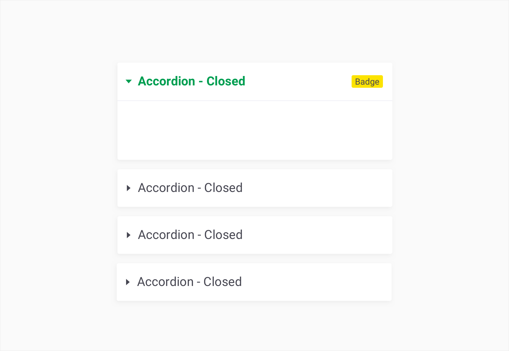
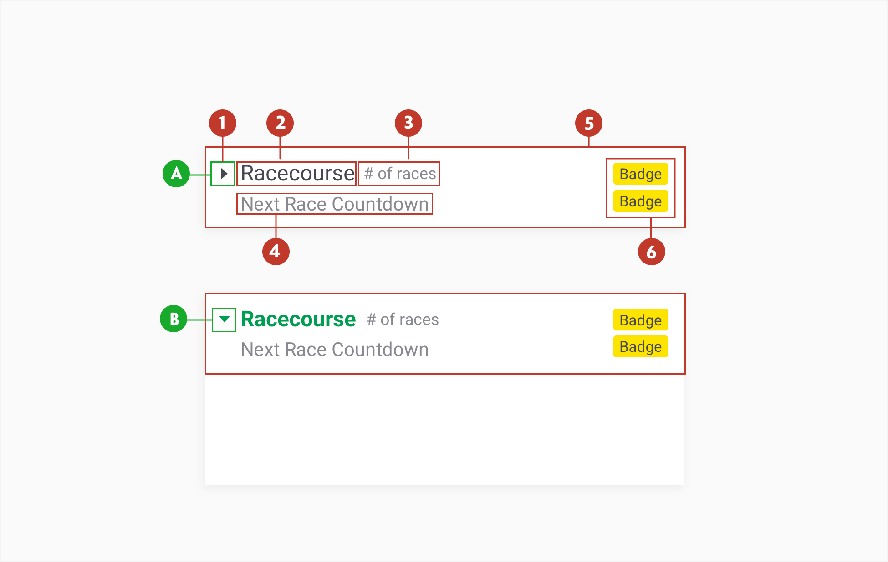
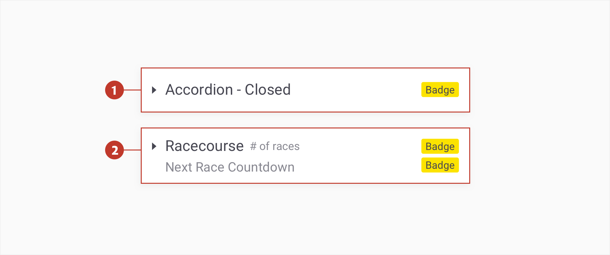
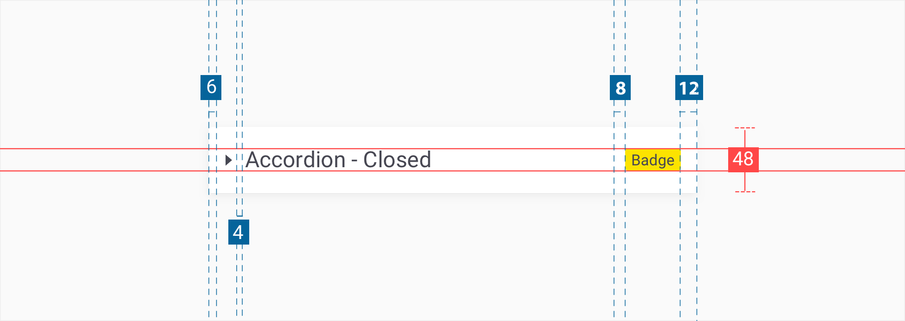
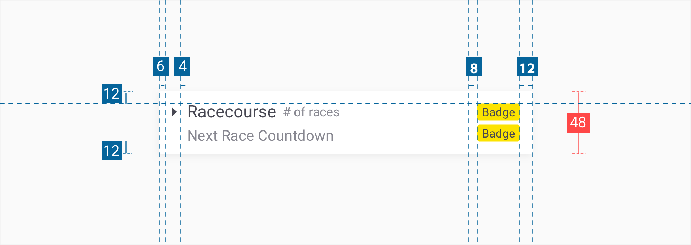
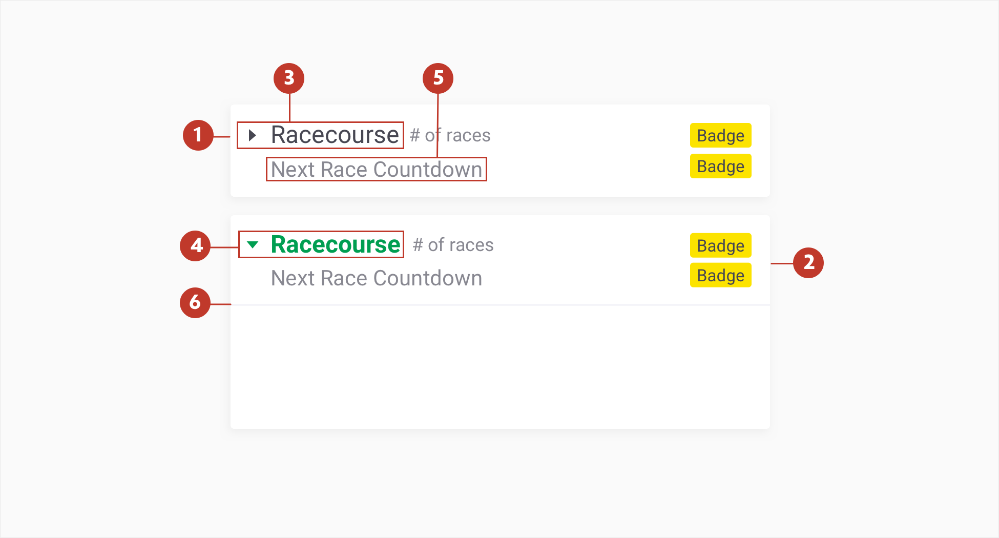

# Accordion

### About accordion

An accordion menu is a component that reveals or hides lists of links or items. The primary use is to reduce the  screen space used for long lists and make it easier for users to scan information. The accordions should:

- Reduce scrolling
-  Groups items into a simple hierarchy
-  Provides a quick overview
-  Makes it faster and easier to scan than a long list of items

### Usage 

When you need to display long, hierarchical lists of categories and sub-categories.

- Multiple accordions can be open at the same time

- An accordion can have one panel open by default on initial display

- Accordions have a distance of 8px between each other 

### Structure

An accordion list comprises of the following:    	

1. **Arrow** - A visual cue denoting the accordion is open **(a)** or closed **(b)**

2. **Title** - The textual title of the item. May be truncated or wrap over 2 lines, depending on the nature of the event

3. **Number** - Should be used to show the number of races for the event

4. **Subtitle** -  Should be added to indicate the next race status

5. **Row** - The area bounding the title and icon.

6. **Badges (optional)** - An icon used to promote and show offers available. The max number off badges is 2. Badges are stacked. 

### Types

For standard accordions or sports pages use the style 1. Some pages of racing use styles (2 lines).

1. **Primary** - Should be used most. 

2. **Secondary** - Used when secondary information below the accordion name is needed.

### Specs

##### Primary

##### Secondary

There is no limit to the height of an open row, however, the padding specs above should be followed. The width of an Accordion varies based on the content, layout and page design. The chevron icon can be found on the **iconography** library page. 

Include padding between labels, body copy and separation lines to provide breathing room between elements.

**Note:** Padding on the left is 6px to allow room for the arrow icon.

### Colour

Accordions use custom colour on six elements: the background, title, subtitle, extra information, icon, and pressed state.

| Element | Category                 | Attribute                     | Value                                      |
| ------- | ------------------------ | ----------------------------- | ------------------------------------------ |
| 1.      | Background               | Token Color Opacity | $color-white #ffffff 100%        |
| 2.      | Box Shadow               | Size Color Opacity  | 0px 2px 8px 0px #000000 16%      |
| 3       | Arrow and Title          | Token Color Opacity | $color-gunpowder #474752 100%    |
| 4.      | Arrow and Title - Active | Token Color Opacity | $color-pigmentgreen #009E51 100% |
| 5.      | Subtitle                 | Token Color Opacity | $color-manatee #73737D 100%      |
| 6.      | Numer of races           | Token Color Opacity | $color-manatee #73737D 100%      |
| 6.      | Line                     | Token Color Opacity | $color-goshtwhite #F2F2F7 100%   |

### Typography

All Accordion labels are set in sentence case and should not exceed three words. 

| Element           | Category  | Attribute                                     | Value                                    |
| ----------------- | --------- | --------------------------------------------- | ---------------------------------------- |
| Title (normal)    | h400      | Typeface Font Size Line height | Roboto  Regular 16px 24px |
| Title (active)    | h300 bold | Typeface Font Size Line height | Roboto  Bold 16px 24px    |
| Subtitle          | h300      | Typeface Font Size Line height | Roboto  Regular 14px 20px |
| Extra information | H200      | Typeface Font Size Line height | Roboto  Regular 12px 20px |

### Interaction & transition

Each accordion is expanded/collapsed by tapping **the row (5)**.

Do not collapse/expand accordions without a transition.  Collapse and expand should happen very quickly. A good rule of thumb is complete an expand/collapse in 300 milliseconds using a SlideDown. 

### Live Component 

In case you want to know more, you can find more information about the accordions on **storybook**.
