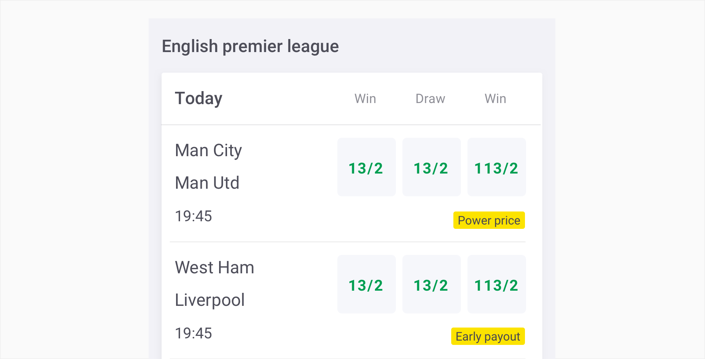

# Badge

## About badges

Badges use our value colour, combined with a filled background style that makes them stand out within or next to another component.

## Usage 

Use badges to draw attention to new or promotional content. Badges should not be clickable. 

## Structure

Badges use a solid straight to the point structure. Badges consist of a container and a label. We do not use icons on  badges allowing a seamless experience throught our platform.

1.**Container**-  Surrounds a text label.

2.**Main label-** The label can be a name of a promo or functionally. 

## Variations

1.**Promo**- Choose a promo badge for promotional information, such as money back free bet, power price, extra place, early payout, no runner no bet and offer .  

## Specs

Badges are small enough to fit next to or within another element.

## Colour

### Promo Badge

All promo badges use our yellow colour creating a higher focus on our value.

| Element | Category   | Attribute                     | Value                                           |
| ------- | ---------- | ----------------------------- | ----------------------------------------------- |
| 2.      | Main Label | Token Color Opacity | $colour-gun-powder #474752 100%  |
| 1.      | Background | Token Color Opacity | $color-yellow #FCE300 100%            |

## Typography

| Element    | Category | Attribute                                     | Value                                   |
| ---------- | -------- | --------------------------------------------- | --------------------------------------- |
| Main Label | xSmall   | Typeface Font Size Line height | ARoboto  Regular 11px 16 |

## Live Component

In case you want to know more, you can find more information about the Badges on **storybook**.
