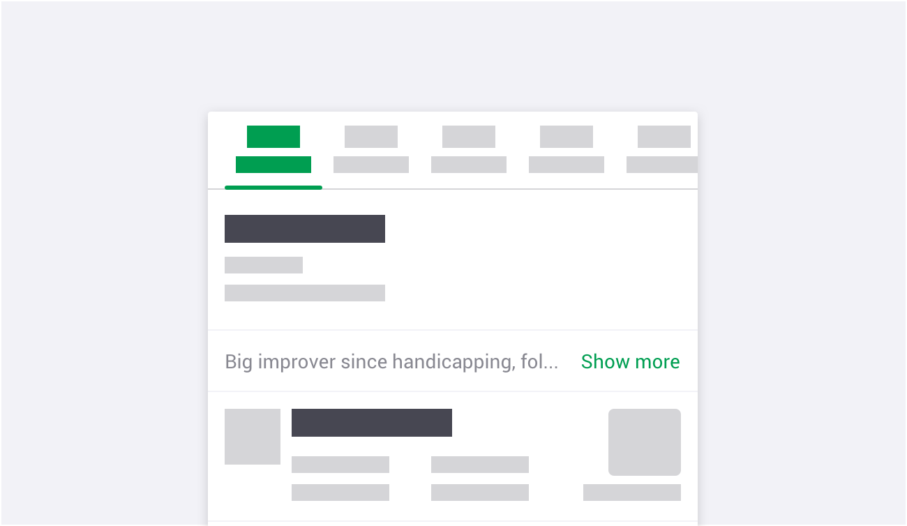
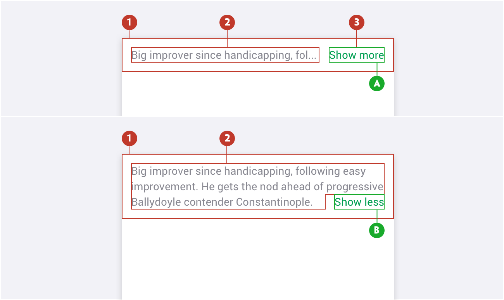
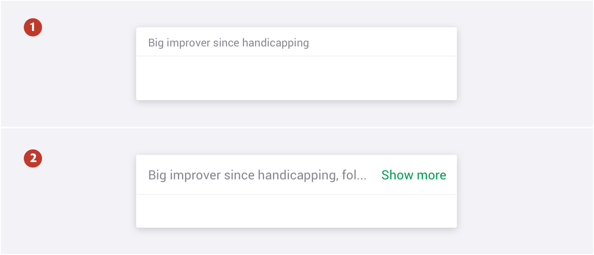
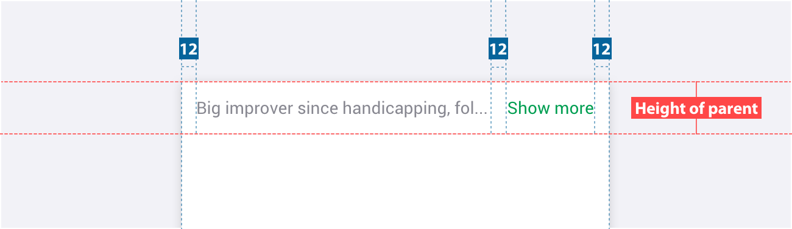
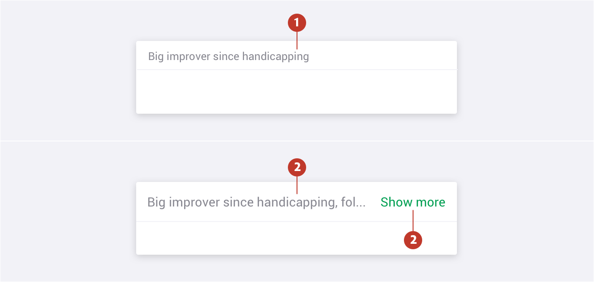

# Blurb

### About Blurb

Blurb is a component used to show information with a **Show more** link option allowing the user to see a detailed version of the information shown. Blurb can be used throughout the platform although it is mostly used to show content regarding markets.

### Usage 

Use blurb to present a concise view of information. A blurb is, essentially, an abridged section of information giving the ability for a user to see a detailed view by clicking on the show more.

### Structure

A Blurb comprises the following:

1. **Container** - Is around a text label.   
2. **Text label** - Text that indicates a detailed version of the information.
3. **Link** - A link denoting Show more **(A)** or Show less **(B)**

### Types

1. **Default** - Used when detailed text label fits inside the container. 

2. **Dynamic** - Used when detailed text label is larger than the blurb container size. We use elipses when shortening text before “Show more”. 

### Specs

### Colour

| Element | Category | Attribute | Value                |
| ------- | -------- | --------- | -------------------- |
| 1.      | Text     | Color     | $color-manatee       |
| 2.      | Link     | Color     | $color-pigment-green |

### Typography

| Element | Category | Attribute                                     | Value                                          |
| ------- | -------- | --------------------------------------------- | ---------------------------------------------- |
| 1.      | H200     | Typeface Font Size Line height | Roboto  Regular 12px 18px / 1.5 |
| 2.      | H300     | Typeface Font Size Line height | Roboto  Regular 14px 20px / 1.4 |

In case you want to know more, you can find more information about the accordions on storybook (Link).

In case you want to know more, you can find more information about the tabs on **[storybook](https://abacus.sct.dev.betfair/docs/#/components/blurb/)**.
