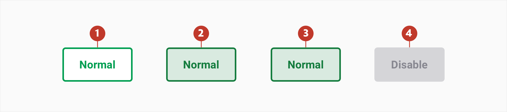

# Buttons

### About buttons

Buttons are used to trigger actions. There are a variety of different button styles applied throughout our products each used to represent a specific type of action.

The button label uses sentence case and are as short as possible, while clearly explaining what happens when the button is clicked.

Avoid using disabled buttons to prevent users from completing an intended action without providing an explanation as to why the button has been disabled.

### Usage 

 They are placed throughout the UI, in places like:

- Cards

- Forms

- Modals

- Sidebar

### Structure

Buttons can contain a combination of a clear label and an icon while links are always text.

1. **Container** - Is around a text label.   
2. **Main label** - Text that indicates the result of selecting the button.
4. **Secondary label** - Text that gives more detail about the main label.

### Types

1. **Default button** - Default buttons have the highest emphasis and are used as the primary call to action on a page. Used in different places means the colour for the text and background often changes.
2. **Outlined button** - Use with a default button for actions that are less crucial such as "cancel". 
3. **Link button** - Link buttons are used to navigate to another page or to be on the footer of a card to show more or less information. The icon is optional and should be used on links that redirect to another page. 
4. **Icon button** - Use for actions that can be represented by an icon.
5. **Round button** - Round buttons are used to create a patternized group of actions and can have either text or an icon as a label representing the action.
6. **Square button** - Used when the main label is not enough to explain the action and needs some extra info.

### Specs

**Note:** The default, outlined, icon and detail button have `border-radius:4px`. 

### Colour

##### Primary button

| Element | Category | Attribute                             | Value                                           |
| ------- | -------- | ------------------------------------- | ----------------------------------------------- |
| 1.      | Normal   | Background Color Text-color | $color-pigment-green #1BAA55 \$ffffff |
| 2.      | Hover    | Background Color Text-color | $color-pigment-jewel #147C3E \$ffffff |
| 3.      | Active   | Background Color Text-color | $color-pigment-jewel #147C3E \$ffffff |
| 5.      | Disable  | Background Color Text-color | $color-wood-ash #D5D5D8 #888891       |

##### Secondary button

| Element | Category | Attribute                                         | Value                                                        |
| ------- | -------- | ------------------------------------------------- | ------------------------------------------------------------ |
| 1.      | Normal   | Background color Text-color Border | $color-white" #ffffff #1BAA55 $color-pigment-green |
| 2.      | Hover    | Background color Text-color Border | $color-panache" #ffffff #1BAA55 $color-pigment-green |
| 3.      | Active   | Background color Text-color Border | $color-panache" #ffffff #1BAA55 $color-pigment-green |
| 5.      | Disable  | Background Text-color Border            | $color-wood-ash #D5D5D8 #888891                    |

##### Round button

| Element | Category | Attribute                                   | Value                                                      |
| ------- | -------- | ------------------------------------------- | ---------------------------------------------------------- |
| 1.      | Normal   | Background Border Text/icon color | \$color-white ​\$color-wood-ash ​\$color-gunpowder |
| 2.      | Hover    | Background Border Text/icon color | \$color-panache \$color-jewel ​\$color-jewel      |
| 3.      | Active   | Background Border Text/icon color | \$color-panache \$color-jewel \$color-jewel      |
| 4.      | Disable  | Background Border Text/icon color | \$color-white \$​color-woodash ​\$color-woodash    |
| 5.      | Delete   | Background Text/icon color             | \$color-red \$color-white                             |

##### Square button

| Element | Category | Attribute                  | Value                                        |
| ------- | -------- | -------------------------- | -------------------------------------------- |
| 1.      | Normal   | Background Text-color | \$color-ghostwhite ​\$color-pigmentgreen |
| 2.      | Hover    | Background Text-color | \$color-pigmentgreen ​​\$color-white      |
| 3.      | Active   | Background Text-color | \$color-pigmentgreen \$color-white      |
| 4.      | Disable  | Background Text-color | \$color-ghost-white ​\$color-woodash     |

### Typography

| Element | Category    | Attribute                                     | Value                                 |
| ------- | ----------- | --------------------------------------------- | ------------------------------------- |
| 1 & 2   | h300 bold   | Typeface Font Size Line height | Roboto  Bold 16px 20px |
| 4       | Large Bold  | Typeface Font Size                  | Roboto  Bold 16px           |
| 5       | xLarge Bold | Typeface Font Size                  | Roboto Bold 16px            |
| 5       | xSmall      | Typeface Font Size                  | Roboto Regular 11px         |

### Interaction & transition

A loading animation is used when performing when computational or connections speeds are slow. They help to notify users that loading is underway. 

### Live Component 

In case you want to know more, you can find more information about the button on **[storybook](http://abacus.app.betfair/docs/#/)**.
