# Card
### 

### About Card

A card is a container for unique related data containing content and relevant actions and controls. The primary function of the card should be the action - typically to link to a new view or expand to reveal more. See card types below

Card content (e.g. images, text, icons) and quantity can vary greatly, depending on the content being expressed. Cards may be "entry points" to more complex and detailed content or "destinations" in their own right. 

Cards contain actions. These actions may be accessed via icons, text or UI controls are within the context of the card. 

- UI controls are used for modifying the content of the card.
- Text may contain inline links.
- Supplemental actions should have some form of visual affordance to distinguish them from other supplemental actions e.g. a line, an arrow, a UI element

One or more cards may be presented in a view. Card collections can move horizontally and/or vertically.

Cards may be controlled by UI outside of the array of cards e.g. a segmented bar or accordion.

Cards do not have a maximum height. Cards height may exceed the height of the viewport. Cards may expand to accommodate the content rather than truncate.

### 

### Usage 

Use cards to present discreet sets of content and functionality in a given view. A card is, essentially, a container for content and relevant actions. Cards are not a panacea. They don't replace the need for other UI elements like accordions, lists or buttons. Before using a card consider whether some other UI might be better. Cards are intended to serve as a UI component rather than serve a purely decorative function.

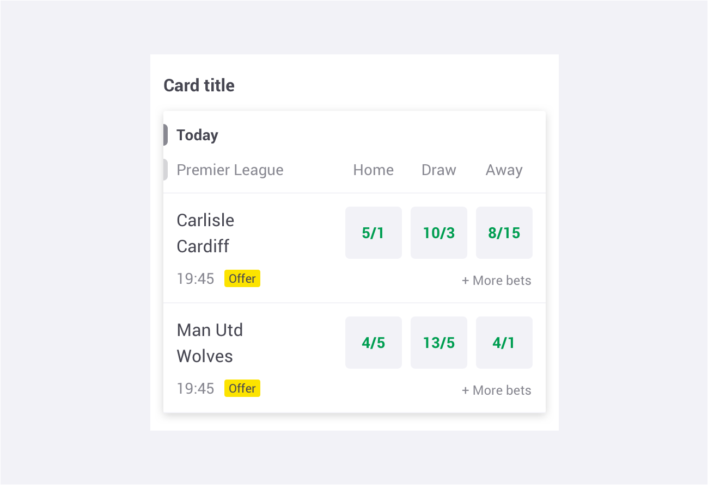

### 

### Structure

A card comprises the following:

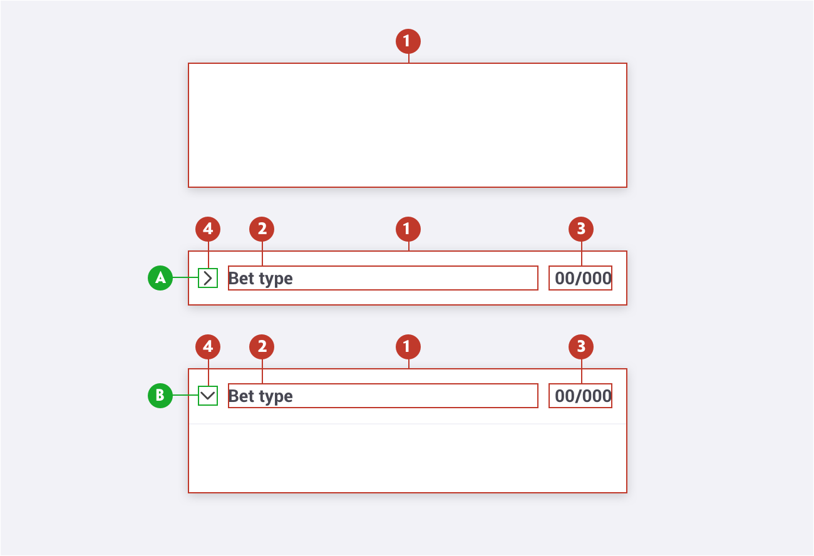

1. **Card** -  A discreet area surrounding the card. 
2. **Title** - The textual title of the item. May be truncated if bigger that the % of space available. 
3. **Odd** - Should be used to show the odd value.
4. **Arrow** - A visual cue denoting if the accordion is open **(A)** or closed **(B)**.

### 

### Types

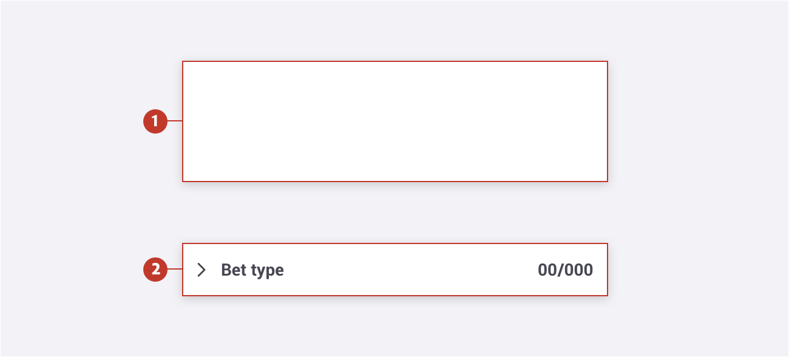

1. **Primary** - Should be the most used. 

2. **Expanded** - Should be used on the betslip only, to group similar bets (ex: Accumulators, Same Game Multi).

### 

### Title

The card title is placed outside of the card container. This is especially useful for separating different types of content within the same title.

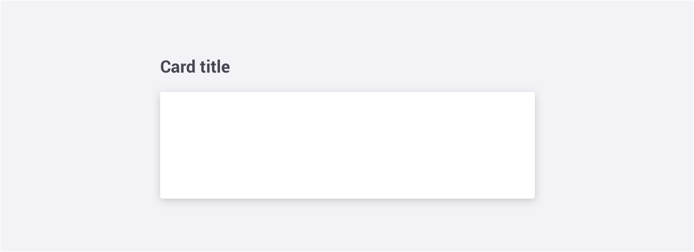

### 

### Footer

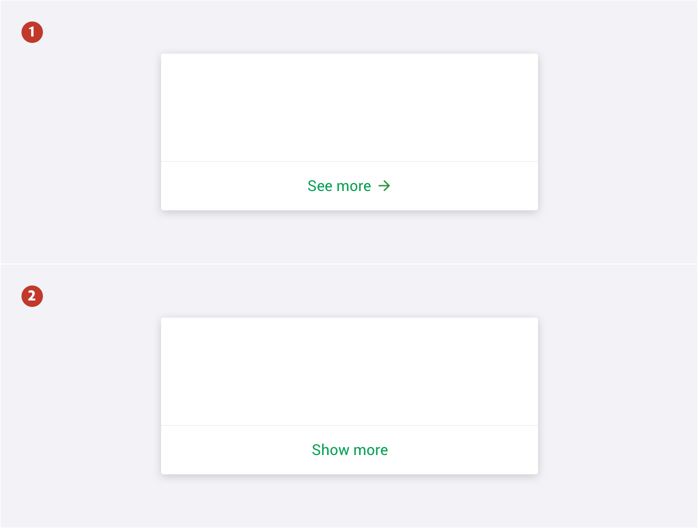

1. **Link** - The link footer allows the user to navigate and access additional information if and when required.

2. **Expand** - The expand footer is beneficial to artificially limit the vertical height of a card to ensure a page length that’s digestible.

### 

### Specs

##### Primary Card

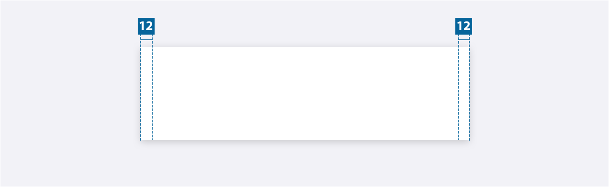

There is no limit to the height of the card, however, the padding specs above should be followed. The width of an card varies based on content, layout and page design.

**Note**: All the cards have a `border-radius:2px`

##### 

##### Expanded Card

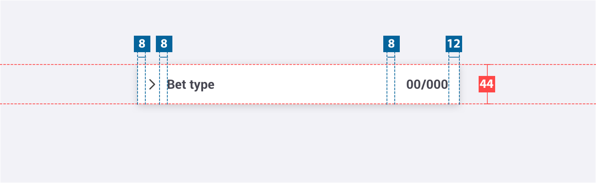

There is no limit to the height of an open row, however, the padding specs above should be
followed. The width of an expanded card varies based on the content, layout, and page design. The
chevron icon can be found on the iconography library page.

**Note:** Padding on the left is 8px because we are considering the bondery box on the arrow
icon. 

##### 

##### Title

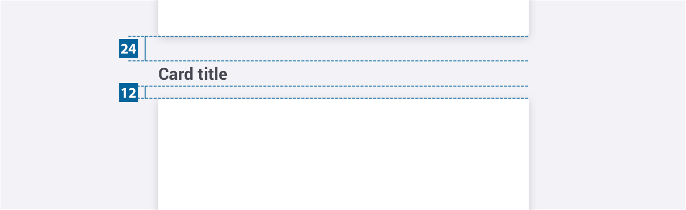

##### 

##### Footer

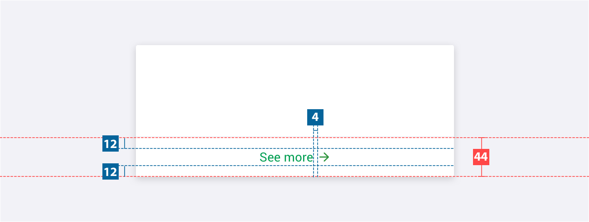

### 

### Colour

##### Primary

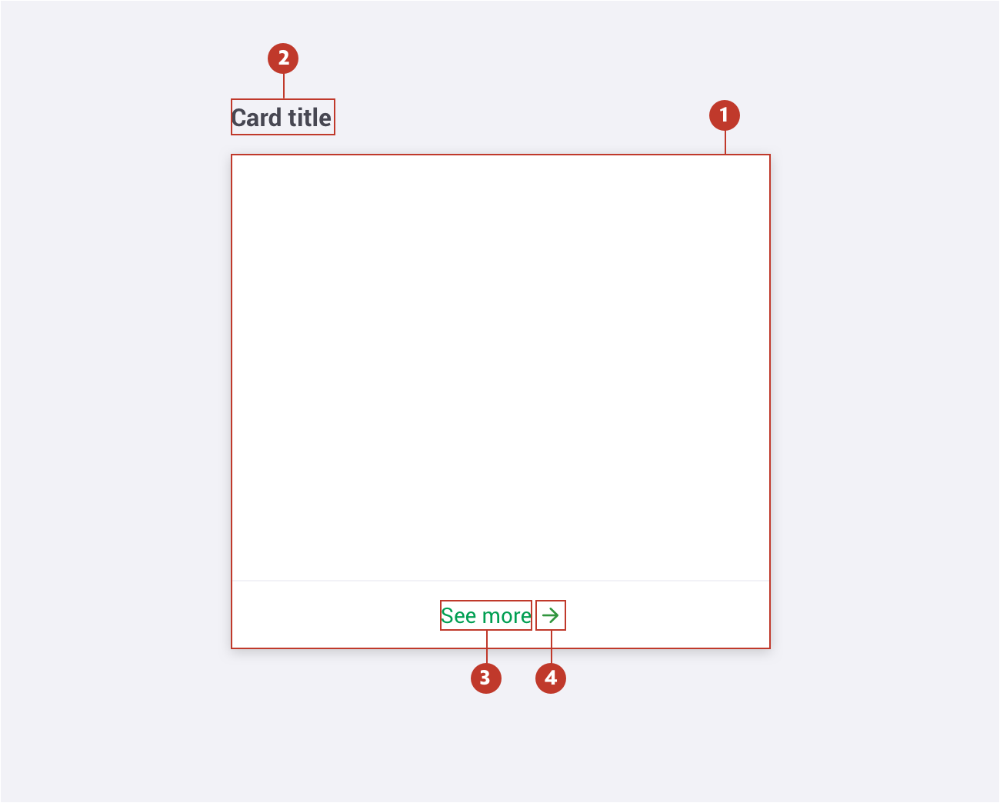

| Element | Category            | Attribute                                    | Value                                                    |
| ------- | ------------------- | -------------------------------------------- | -------------------------------------------------------- |
| 1.      | Background          | Color Shadow-color Shadow-position | $color-white rgba(0,0,0,0.16); 0px 2px 8px 0px |
| 2.      | Title               | Color                                        | $color-gun-powder                                        |
| 3. & 4. | Link & Icon         | Color                                        | $color-pigment-green                                     |
| 3. & 4. | Link & Icon : Hover | Color                                        | $color-jewel                                             |

#####  

##### Expanded

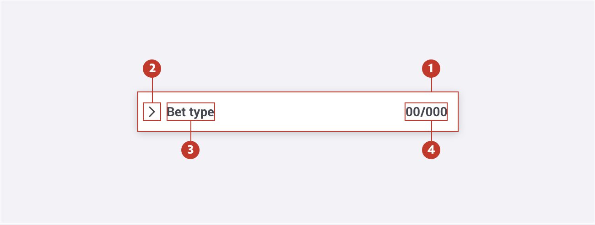

| Element | Category   | Attribute                                    | Value                                                     |
| ------- | ---------- | -------------------------------------------- | --------------------------------------------------------- |
| 1.      | Background | Color Shadow-color Shadow-position | $color-white rgba(0,0,0,0.05); -1px 2px 6px 0px |
| 2.      | Icon       | Color                                        | $color-gun-powder                                         |
| 3.      | Title      | Color                                        | $color-gun-powder                                         |
| 4.      | Odd        | Color                                        | $color-gun-powder                                         |

### 

### Typography

| Element | Category  | Attribute                                     | Value                                     |
| ------- | --------- | --------------------------------------------- | ----------------------------------------- |
| Title   | H200 bold | Typeface Font Size Line height | Arial Bold 12px 18px / 1.5 |

###  

### Live Component

## Interaction & transition

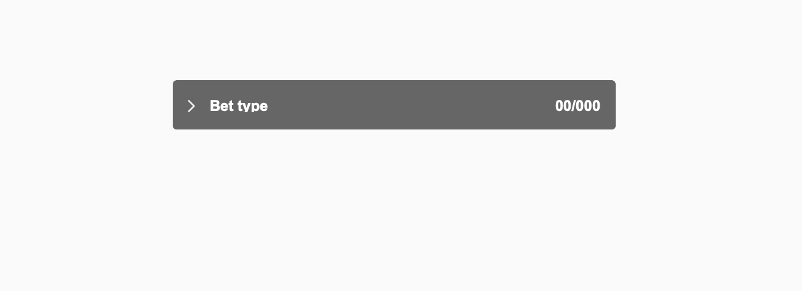

## Live Component

In case you want to know more, you can find more information about the accordions on storybook (Link).