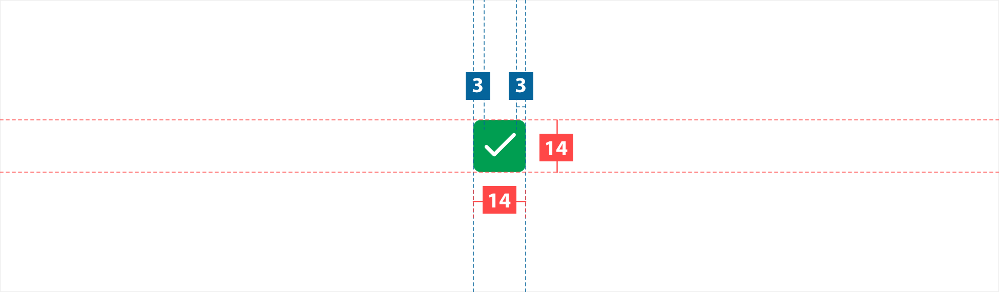

# Checkbox

### About checkbox

A checkbox has two primary states: selected and unselected. 

They can be used for a single item, or for a list of items where people can choose any number of options, it can also be used to turn an option on or off.

### 		

### Usage 

When used in a group, each checkbox is independent of all other checkboxes in the list; checking one box doesn't uncheck the others.

Use checkboxes to:

- Select one or multiple items from a list

- Select to apply a promo or functionallity 

### Structure

1. **Checkbox** - selection control
2. **Label** - Text label associated with the checkbox

### Specs

**Note:** The checkbox have `border-radius:2px`.

### Colour

| Element | Category | Attribute                     | Value                                 |
| ------- | -------- | ----------------------------- | ------------------------------------- |
| 1.      | Disable  | Token Color Opacity | $color-manatee #73737D 100% |
| 2.      | Selected | Token Opacity            | $color-pigment-green 100%        |
| 3.      | Check    | Token Opacity            | $color-white 100%                |

### Typography

| Element  | Category  | Attribute                                     | Value                                     |
| -------- | --------- | --------------------------------------------- | ----------------------------------------- |
| 1. Label | H300      | Typeface Font Size Line height | Roboto  Regular  14px 16px |
| 2. Label | H300 Bold | Typeface Font Size Line height | Roboto  bold 14px 16px     |

### Live Component

In case you want to know more, you can find more information about the accordions on **stoorybook**.
