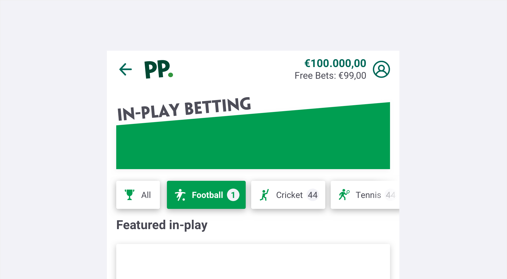
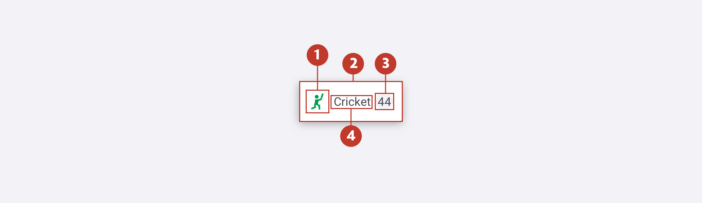
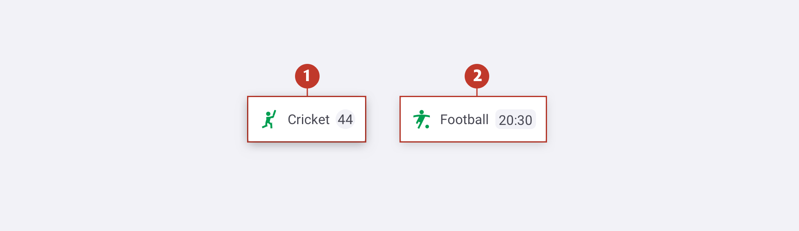
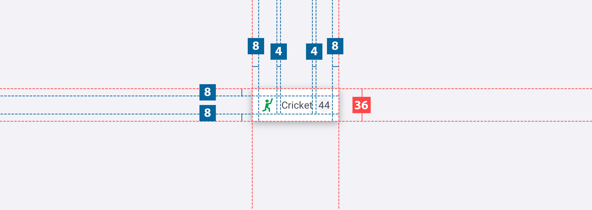
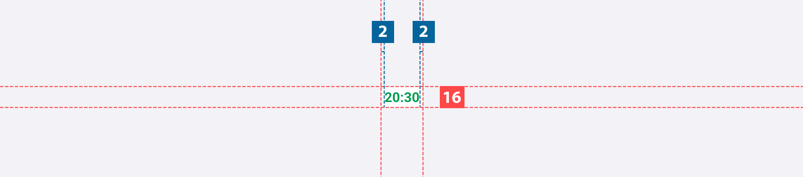
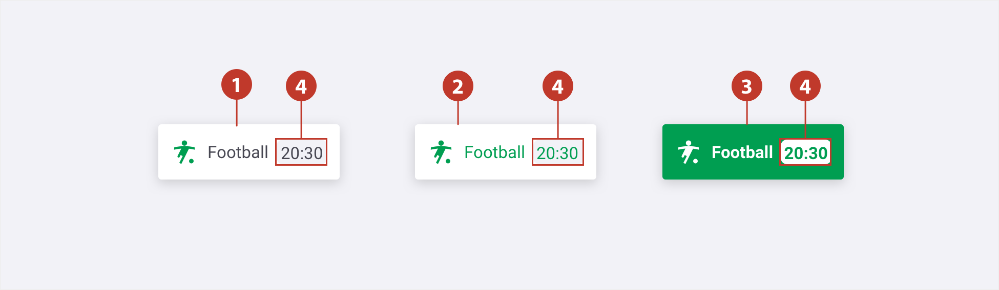
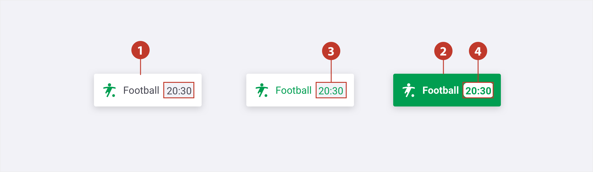

# Chips
## About Chips

Chips allow our users to make selection or filter content. Unlike buttons, this should be treated only to filter/treat information rather than providing a destination.

#### 

## Usage 

### How to Use

- They should be compact, be careful of the content needs to be clear.

- They need to be relevant and have a clear relationship to the content they represent.

- Chips should make the task to sort content easier.

  

### How Not to Use

Chips are not buttons, so they should not bring you to another page/location.

#### 

## Structure

A Chip comprises the following:

1. **Icon** -  An area where you can add one icons.
2. **Container** -  Surrounds chip label, icon and title.
3. **Label** - This text label could be a counter or countdown.
4. **Title** - The textual label of the item. May be truncated if bigger than the % of space available.

## Types 

For standard cases like the in- play or virtuals, use the primary version.

1. **Primary** - Should be the most used. 
2. **Secondary** - Should be used on horse racing or greyounds next races.
#### 

## Specs

When using the primary with counter, a `padding-right: 2px` and `padding-radius:2px`  needs to be added from the edge of the background

###### 

###### 

## Colour

| Element | State  | Category   | Attribute               | Value                                             |
| ------- | ------ | ---------- | ----------------------- | ------------------------------------------------- |
| 1.      | Normal | Background | Color Text-colour  | $color-white \$color-gunpowder               |
| 2.      | Hover  | Background | Color Text-colour  | $color-white \$color-pigmentgreen            |
| 3.      | Active | Background | Color Text-colour  | $color-pigmentgreen \$color-white            |
| 4.      | Normal | Counter    | Colour Text-colour | $color-ghostwhite \$color-gunpowder     |
| 4.      | Hover  | Counter    | Colour Text-colour | $color-ghostwhite \$color-pigmentgreen  |
| 4.      | Active | Counter    | Colour Text-colour | $color-white \$color-pigmentgreen       |

###### 

###### 

## Typography

| Element | Category | Attribute                                     | Value                                         |
| ------- | -------- | --------------------------------------------- | --------------------------------------------- |
| 1.      | H100     | Typeface Font Size Line height | Roboto Regular 11px 16px / 1.4 |
| 2.      | H100     | Typeface Font Size Line height | Roboto Regular 11px 16px / 1.4 |
| 3.      | H100     | Typeface Font Size Line height | Roboto Regular 11px 16px / 1.4 |
| 4.      | H100     | Typeface Font Size Line height | Roboto Bold 11px 16px / 1.4    |

#### 

## Live Component

In case you want to know more, you can find more information about the tabs on **[storybook](http://abacus.sct.dev.betfair/docs/#/)**.