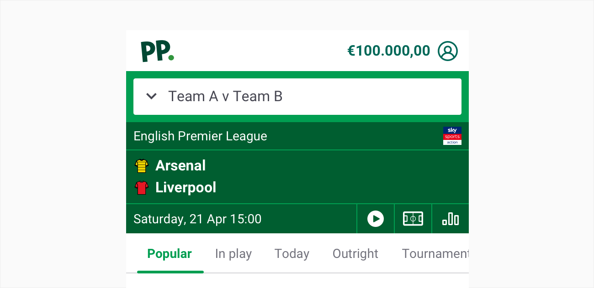
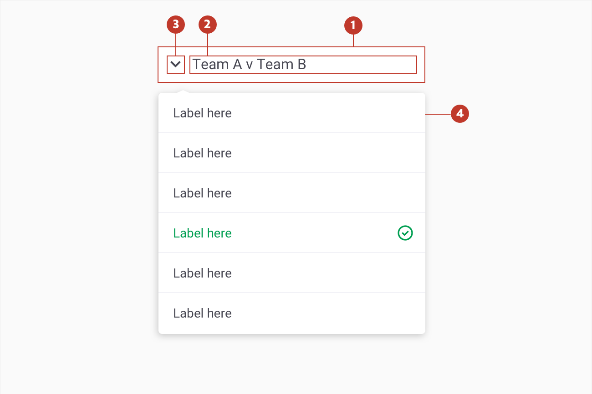
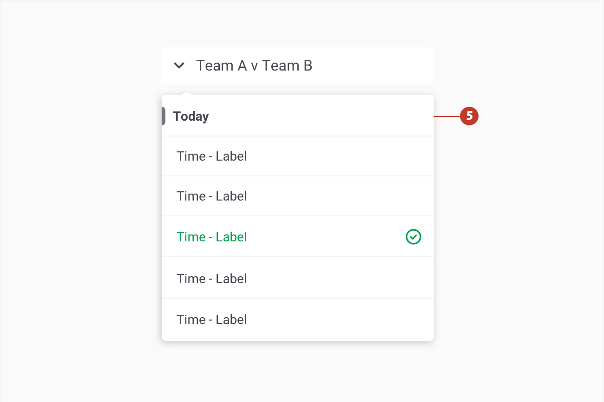
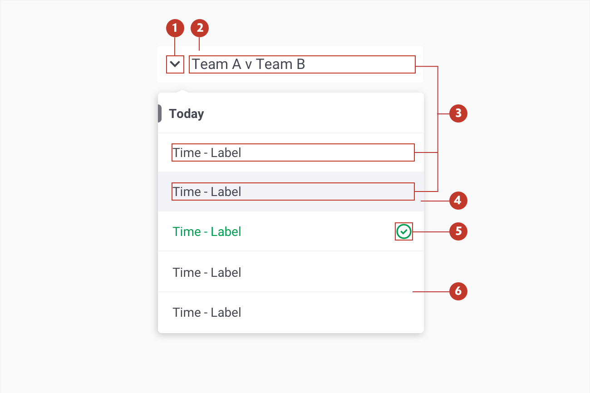
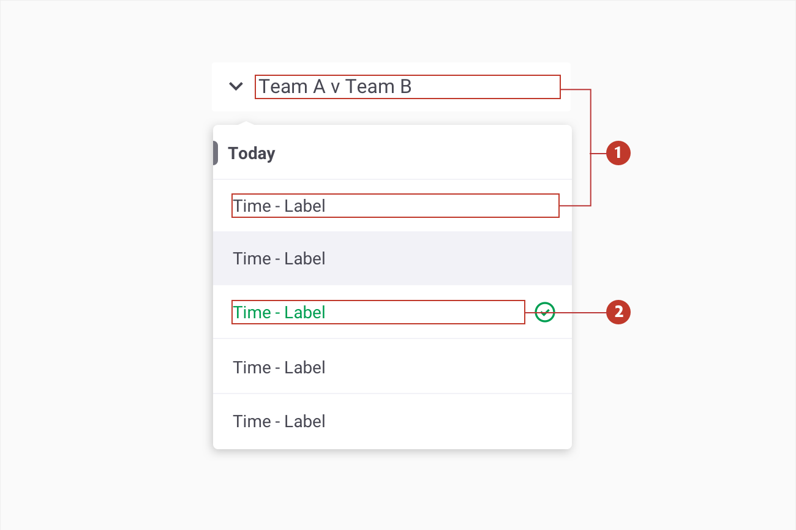

# Dropdown

### About 

Dropdown menus are a compact way to display a list of multiple options. They allow users to choose one option from a list of options.

###  

### Usage 

Use a dropdown menu when you need to give users a list of actions or links to choose from.

By default, selecting a menu item or clicking outside the menu dismisses the menu. You can change this behaviour to keep the menu open on item selection.

Place a descriptive label on the dropdown menu to clearly let users know what options are available.

This helps to keep the user focused on the task they’re trying to complete.

If a user needs to select a market, a good label would be “Select your first goalscorer” but something as simple as “First goalscorer” can also work.

Keep the text short and concise. Long menu items are truncated from the end and an ellipsis added.

### Structure

1. **Container** - contains a list section
2. **List section** - text label associated with the checkbox
3. **Arrow** - the arrow means interactivity and the state of the dropdown menu

4. **Menu** - container for links and action items 

5. **Subheader** -  used to separate different sections

### Behavior

`

### Colour

| Element | Category         | Attribute                     | Value                                       |
| ------- | ---------------- | ----------------------------- | ------------------------------------------- |
| 1.      | Icon             | Token Color Opacity | $color-gun-powder #474752 100%    |
| 2.      | Background       | Token Color Opacity | $color-white #FFFFFF 100%         |
| 3.      | Text             | Token Color Opacity | $color-gun-powder #474752 100%    |
| 4.      | Hover background | Token Color Opacity | $color-ghost-white #f2f2f7 100%   |
| 5.      | Icon             | Token Color Opacity | $color-pigment-green #3009E51 10% |
| 6.      | Divider          | Token Color Opacity | $color-ghost-white #f2f2f7 100%   |

### Typography

| Element  | Category | Attribute                                     | Value                                  |
| -------- | -------- | --------------------------------------------- | -------------------------------------- |
| 1. Label | H400     | Typeface Font Size Line height | Roboto  Regular 16px 24 |
| 2. Label | H400     | Typeface Font Size Line height | Roboto  Regular 16px 24 |
