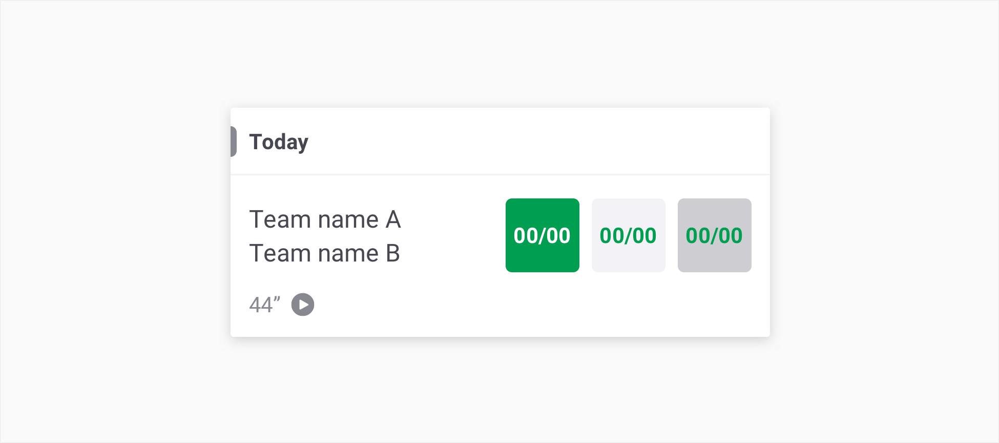
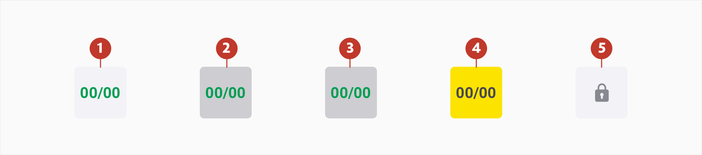
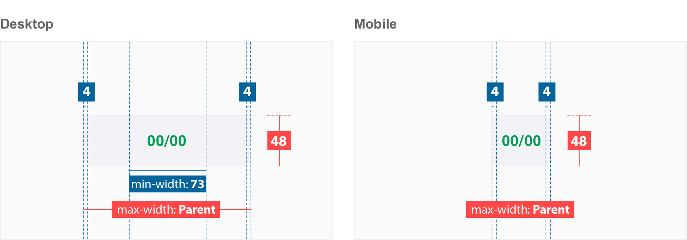
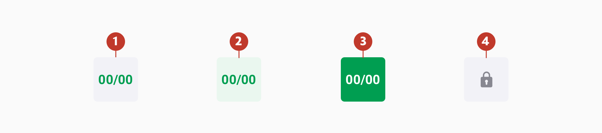
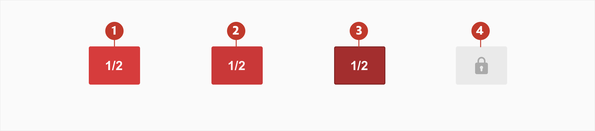
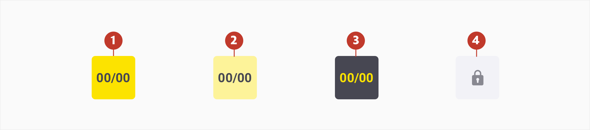
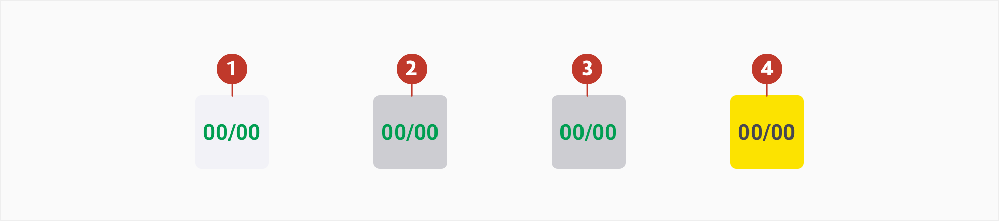

# Bet Button

## About Bet button

Bet buttons allow users to place a bet. They are the starting point for making a selection and when clicked add a desired selection to the betslip.

A button contains a numeric label representing the odds. The odds are expressed as a pair of numbers as fractions (e.g. 4/1) or a single number as decimals (e.g. 5.0) depending on the users preference.  

## Usage 

Bet buttons communicate the price of anything that can be bet on. They are used to tell users the odds associated with a selection in any given match/game/event and act as the primary call to action for bet placement.

## Structure

Bet Buttons are composed of two elements:

1. **Container** - space around the label.   
2. **Numeric Label** - the odds which describe the ratio of pay-out to stake

## Types

1. **Bet Button** - default state of odds for any selection
2. **Bet Button Price Up** - use when the odds for a selection increase
3. **Bet Button Price Down** - use when the odds for a selection decrease
4. **Bet Button PowerPrice** - use to signify increased value for a selection
5. **Bet Button Disabled** - use to indicate a suspended or discontinued selection

## Specs

## Colour

### Bet Button

| Element | Category | Attribute                               | Value                                          |
| ------- | -------- | --------------------------------------- | ---------------------------------------------- |
| 1.      | Normal   | Background Colour Text-colour | $color-ghost-white #F2F2F7 #1BAA55   |
| 2.      | Hover    | Background Colour Text-colour | $color-panache #EAF7EF #1BAA55       |
| 3.      | Active   | Background Colour Text-colour | $color-pigment-green #1BAA55 #ffffff |
| 4.      | Disable  | Background Colour Icon Colour | $color-ghost-white #F2F2F7 #73737D   |

### Bet Button Price Up

| Element | Category | Attribute                                                    | Value                                                        |
| ------- | -------- | ------------------------------------------------------------ | ------------------------------------------------------------ |
| 1.      | Normal   | Background Colour Text-colour<br/ >Overlay<br/ >Opacity | $color-ghost-white #F2F2F7 #1BAA55 #000000 15% |
| 2.      | Active   | Background Colour Text-colour<br/ >Overlay<br/ >Opacity | $color-pigment-green #1BAA55 #ffffff #000000 15% |
| 3.      | Disable  | Background Colour Icon Colour                      | $color-ghost-white #F2F2F7 #73737D                 |

### Bet Button Price Down

| Element | Category | Attribute                                                    | Value                                                        |
| ------- | -------- | ------------------------------------------------------------ | ------------------------------------------------------------ |
| 1.      | Normal   | Background Colour Text-colour<br/ >Overlay<br/ >Opacity | $color-ghost-white #F2F2F7 #1BAA55 #000000 15% |
| 2.      | Active   | Background Colour Text-colour<br/ >Overlay<br/ >Opacity | $color-pigment-green #1BAA55 #ffffff #000000 15% |
| 3.      | Disable  | Background Colour Icon Colour                      | $color-ghost-white #F2F2F7 #73737D                 |

### Bet Button PowerPrice

| Element | Category | Attribute                               | Value                                        |
| ------- | -------- | --------------------------------------- | -------------------------------------------- |
| 1.      | Normal   | Background Colour Text-colour | $color-yellow #FCE300 #474752      |
| 2.      | Hover    | Background Colour Text-colour | $color-lemon #FDF399 #474752       |
| 3.      | Active   | Background Colour Text-colour | $color-gun-powder #474752 #FCE300  |
| 4.      | Disable  | Background Colour Icon Colour | $color-ghost-white #F2F2F7 #73737D |

## Typography

| Element     | Category  | Attribute                                     | Value                                       |
| ----------- | --------- | --------------------------------------------- | ------------------------------------------- |
| 1, 2, 3 & 4 | h400 bold | Typeface Font Size Line height | Roboto  Bold 14px 24px / 1.5 |

## Interaction & transition

When the odds increase or decrease an animation indicates a change in odds and button style. The button changes from **Bet Button** to **Bet Button Price Up** or **Bet Button Price Down**. This signifier is used to notify users of changes. After 4 seconds it fades out and rolls back to the normal bet button colour.

## Live Component 

In case you want to know more, you can find more information about the accordions on **[storybook](http://abacus.sct.dev.betfair/docs/#/)**.	
