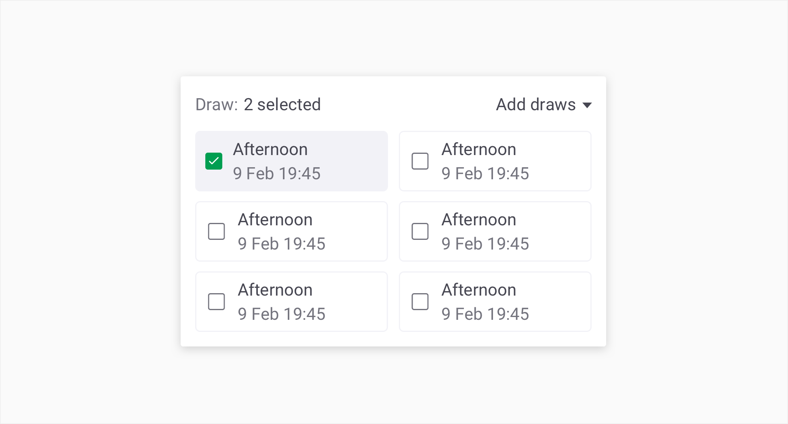
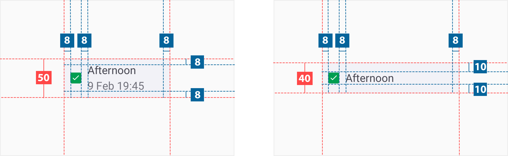
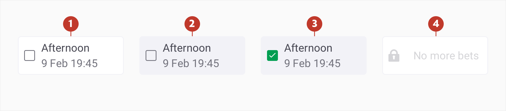

# Option Selector 

### About Option Selector

An option selector allows the user to select one or multiple options from a predifined list.

### Usage 

### Structure

An option selector consists of the following:

2. **Simple selection component** - simple selection component like the checkbox or radio button.
2. **Container** - area bounding the icon and labels.
3. **Main text** - text description of selection.
4. **Secondary text (optional)**

### Specs

### Colour

| Element | Category | Attribute                                                 | Value                                                        |
| ------- | -------- | --------------------------------------------------------- | ------------------------------------------------------------ |
| 1.      | Normal   | Background Border Main text Secondary text | \$color-white \$​Color-ghost-white \$colour-gunpowder \$color-manatee |
| 2.      | Hover    | Background Border Main text Secondary text | \$color-ghost-white \$color-ghost-white \$colour-gunpowder \$color-manatee |
| 3.      | Active   | Background Border Main text Secondary text | \$color-ghost-white \$color-ghost-white \$colour-gunpowder \$color-manatee |
| 4.      | Disabled | Background Border Text Icon                | \$color-white \$color-ghost-white \$color-ghost-white \$color-ghost-white |

### Typography

| Element | Category | Attribute                    | Value                         |
| ------- | -------- | ---------------------------- | ----------------------------- |
| 1.      | H300     | Typeface Font Size | Roboto Regular 14px |

### Live Component 

In case you want to know more, you can find more information about the option selector on **[storybook](http://abacus.sct.dev.betfair/docs/#/)**.
