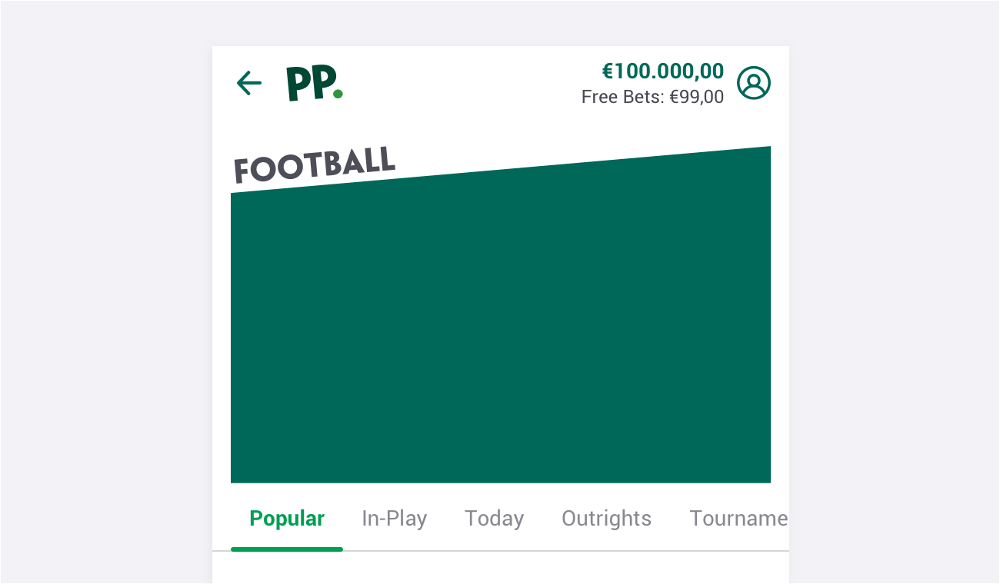
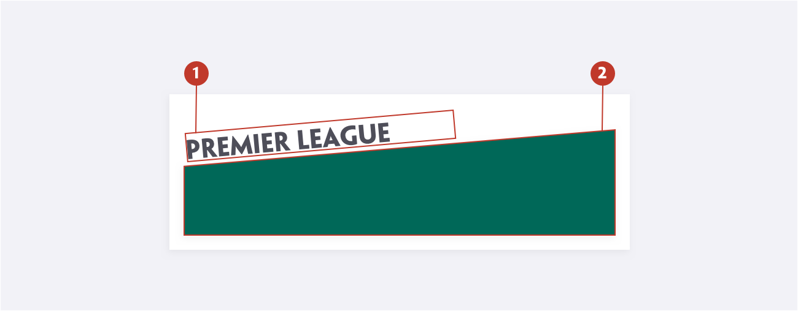
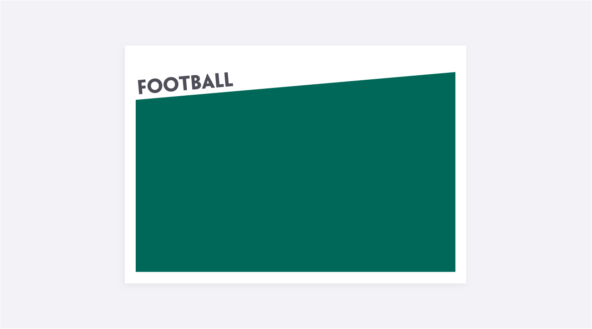
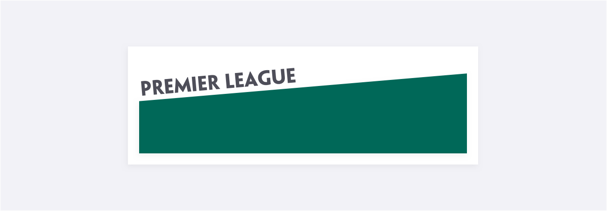
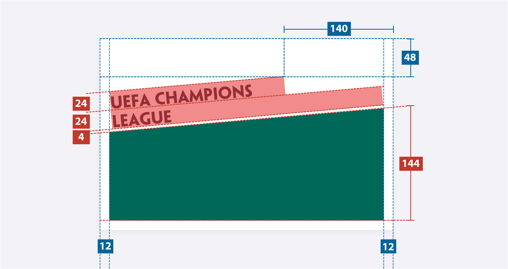
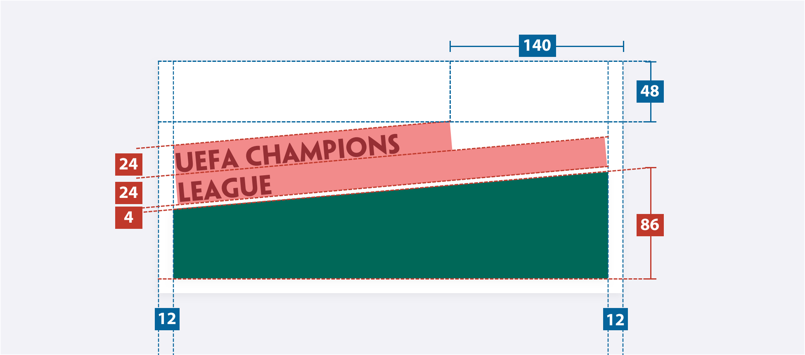
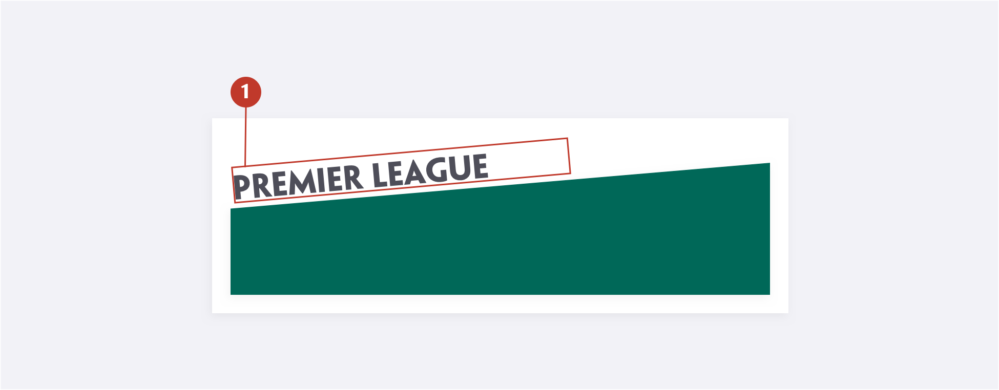

# Page header

### About page headers

The page header is a pattern that helps define the uppermost part a webpage or product. It is the first section that people see before scrolling and provides the core information that users need to identify what page they are on. 

### Usage 

A Page Header is used to display the title and quickly understand what the current page is.

### Structure

1. **Page title** - This refers to the title of the page. Each page has its own unique title.

2. **Promotional area** - This angled shape area supports the angled title. Three different types of content can be applied to it: Carousel, Dedicated images or Fallback images.

### Variations

##### Carousel

The Carousel is used to promote content related to the page.

**Note**: Carousel specifications are part of a separate component.

##### Dedicated

A dedicated image is used to illustrate a specific page. It should be used only when there is no carousel.

**Note**: Images to be given by studio.

##### Fallback

A fallback image is used to illustrate a generic page. It should be used only when there is no carousel nor dedicated image.

**Note**: Images to be given by studio.

### Specs

##### Carousel

##### Dedicated / Fallback

### Colour

| Element  | Attribute | Value            |
| -------- | --------- | ---------------- |
| 1. Title | Color     | $color-gunpowder |

### Typography

| Element  | Category | Attribute                                     | Value                                         |
| -------- | -------- | --------------------------------------------- | --------------------------------------------- |
| 1. Title | H300     | Typeface Font Size Line height | Mischief  Bold 20px 24px / 1.2 |

### 

### Live Component

In case you want to know more, you can find more information about the accordions on **storybook** (N/A).
