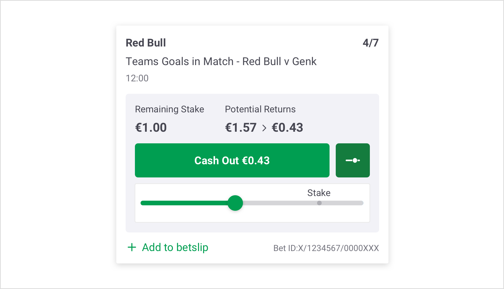
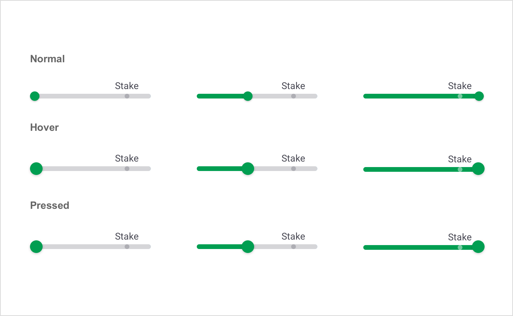
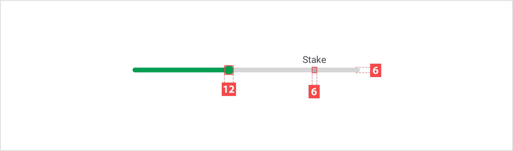
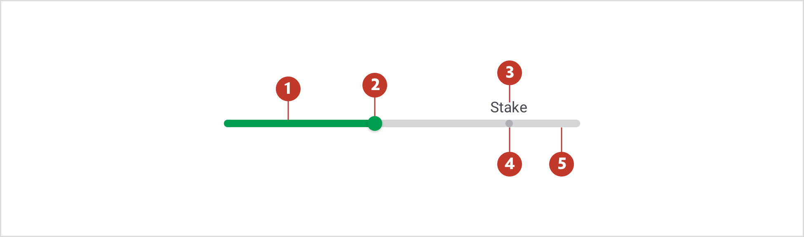
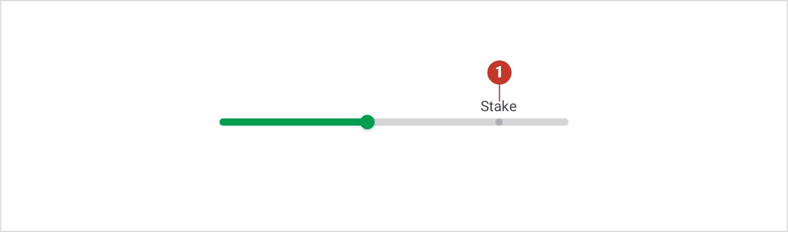

# Slider

### About sliders

Sliders allow users to adjust a selection, where the user can move the handle along a horizontal track to increase or decrease a value from a range of values.

### Usage 

Sliders reflect a range of values along a bar, from which users may select a single value.

### Structure

1**.Track** - The track shows the range available for user selection.

2.**Knot** - Display the selected value through its position, sliding along the track.

3.**Label** - A label displays to show what's the value of the currently stake.  

4.**Mark** - Mark represent current stake value.

### States

Sliders have normal, hover, and pressed states.

### Specs

##### Track specs

##### Mark specs

### Colour

| Element | Category       | Attribute                     | Value                                       |
| ------- | -------------- | ----------------------------- | ------------------------------------------- |
| 1.      | Active Track   | Token Color Opacity | $color-pigment-green #009E51 100% |
| 2.      | Knot           | Token Color Opacity | $color-pigment-green #009E51 100% |
| 3.      | Label text     | Token Color Opacity | $color-gun-powder #474752 100%    |
| 4.      | Mark           | Token Color Opacity | $color-manatee #73737D 50%        |
| 5.      | Inactive Track | Token Color Opacity | $color-wood-ash #D5D5D8 100%      |

### Typography

| Element | Category    | Attribute                                     | Value                                          |
| ------- | ----------- | --------------------------------------------- | ---------------------------------------------- |
| Label   | Medium Bold | Typeface Font Size Line height | Roboto  Regular 12px 16px / 1.4 |

### Interaction & transition

### 

### Live Component

In case you want to know more, you can find more information about the accordions on **storybook**.
