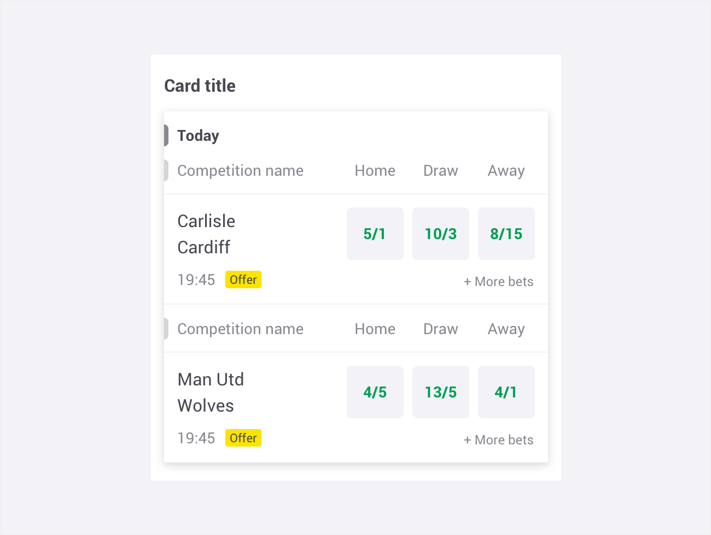
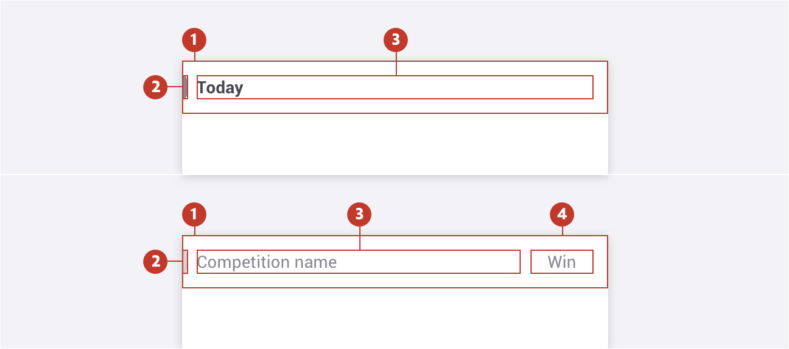
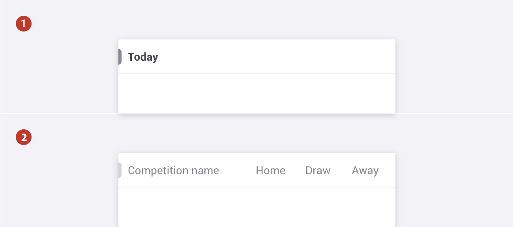
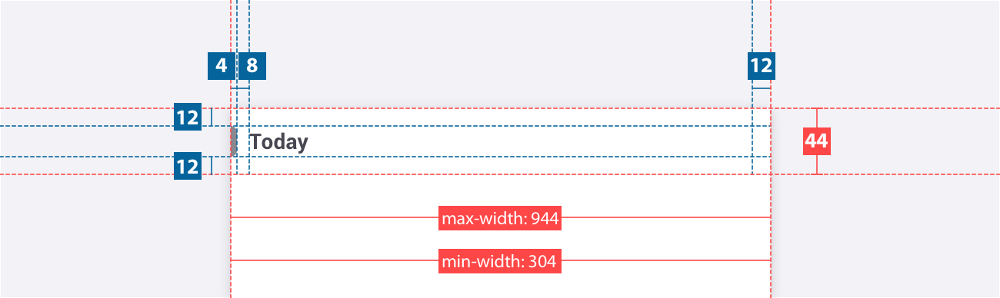
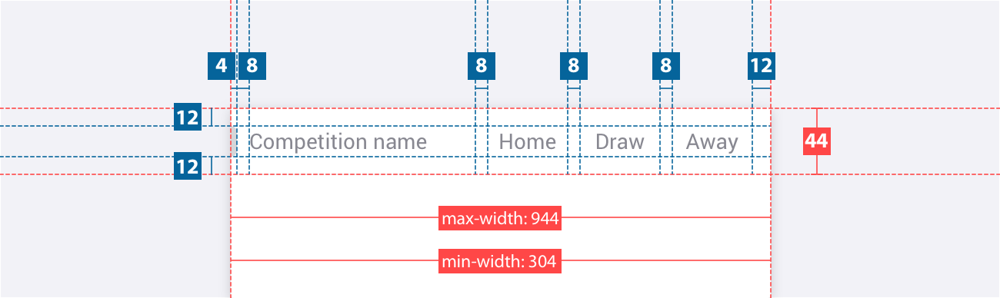
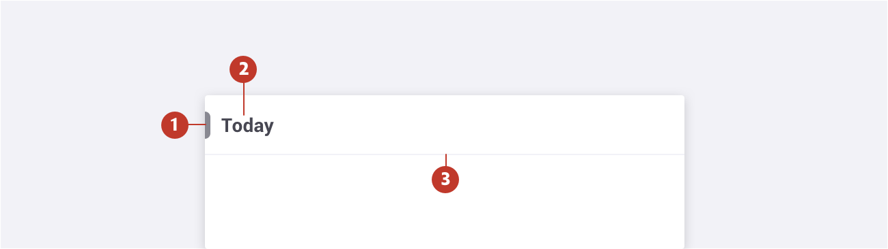
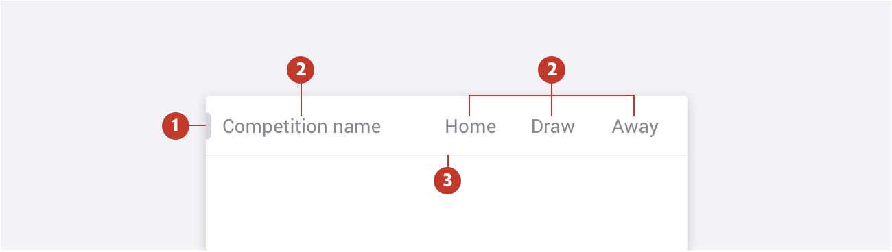
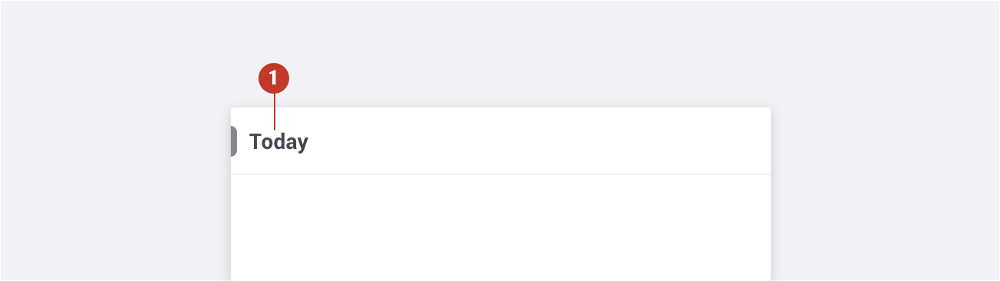
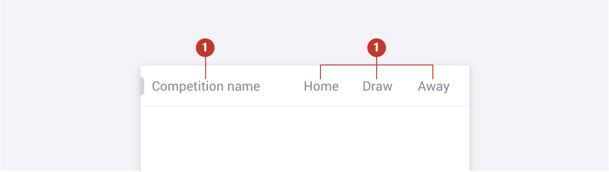

# Subheader

### About subheader

A subheader is a secondary header that defines or separates sections containing related data. Subheaders are normally used to separate different sections in cards. There are two types of subheaders: **Subheader Primary** and **Subheader Secondary**.

### Usage 

Use subheader to separate subsections in cards to define or separate sections containing related data.

### Structure

It should be used in cards, giving a clear understanding to what is beeing displayed in the different sections. 

1. **Container** - Is around a text label.
2. **Signifier** - Placed on the left edge of the card to highlight the subheader. 
3. **Main label** - This refers to the title of the subheader.
4. **Secondary label** - This refers to the secondary label of the subheader

 

### Types 

There are two main subheader types:

1. **Subheader primary** - Subheader primary have higher emphasis and are used as the primary subheaders to separate larger sections in cards. (ex: Today, Tomorrow, Monday).
2. **Subheader secondary** - Subheader Secondary with main label and between one and three secondary labels. Normally applied to competitions or markets.

**Note**: When applying a subheader secondary without a subheader primary, the main label and signifier should have the primary style.

### Specs

##### Subheader Primary

**Note**: When placing two ore more subtitles on top of each other, the bottom margin and divider is removed. 

##### Subheader Secondary

### Colour

##### Subheader Primary

| Element | Category  | Attribute         | Value                       |
| ------- | --------- | ----------------- | --------------------------- |
| 1.      | Signifier | Color             | $color-manatee              |
| 2.      | Text      | Color             | $color-gunpowder            |
| 3.      | Divider   | Color Border | $color-ghost-white 1px |

#####  

##### Subheader Secondary

| Element | Category  | Attribute         | Value                       |
| ------- | --------- | ----------------- | --------------------------- |
| 1.      | Signifier | Token Color  | $color-wood-ash             |
| 2.      | Text      | Color             | $color-manatee              |
| 3.      | Divider   | Color Border | $color-ghost-white 1px |

### Typography

##### Subheader Primary

| Element | Category  | Attribute                                     | Value                                       |
| ------- | --------- | --------------------------------------------- | ------------------------------------------- |
| 1.      | H300 Bold | Typeface Font Size Line height | Roboto  Bold 14px 20px / 1.4 |

##### Subheader Primary

| Element | Category | Attribute                                     | Value                                          |
| ------- | -------- | --------------------------------------------- | ---------------------------------------------- |
| 1.      | H300     | Typeface Font Size Line height | Roboto  Regular 14px 20px / 1.4 |

In case you want to know more, you can find more information about the accordions on **storybook** ( http://abacus.sct.dev.betfair/storybook/?path=/story/components-subheader--primary

In case you want to know more, you can find more information about the tabs on **[storybook](https://abacus.sct.dev.betfair/docs/#/components/subheader/)**.