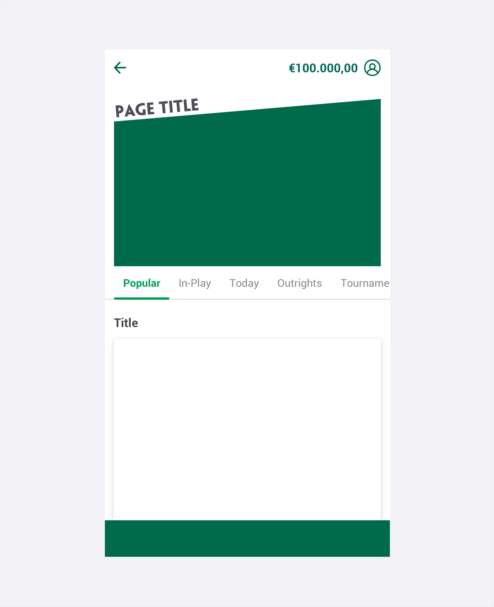
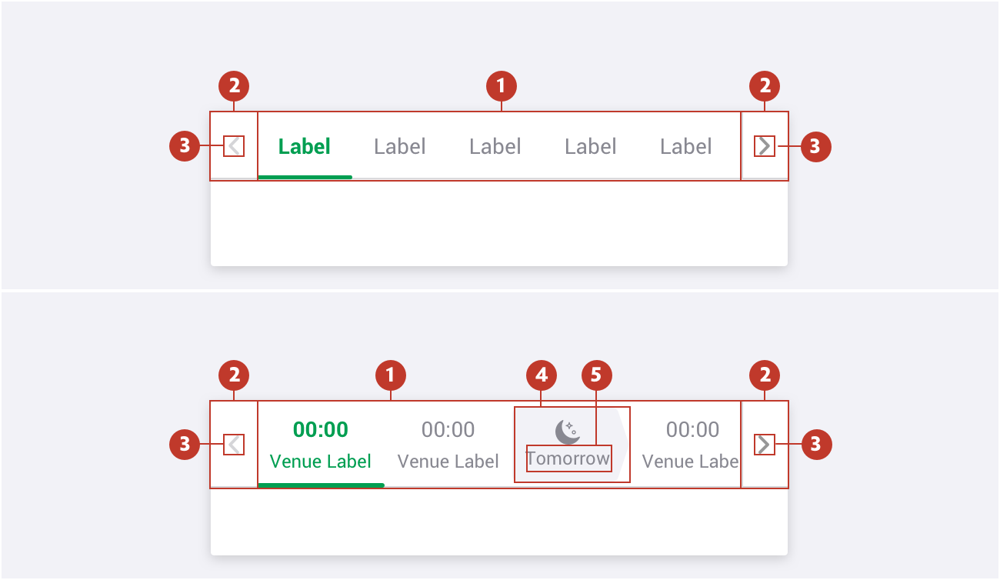
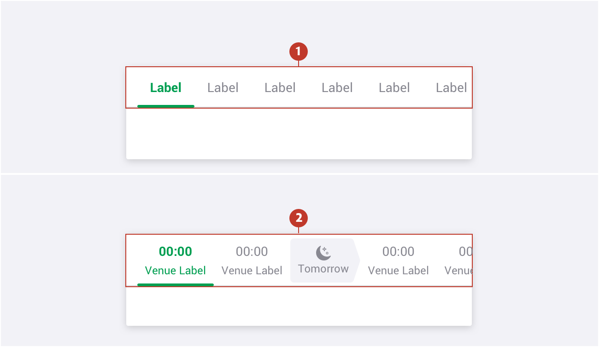
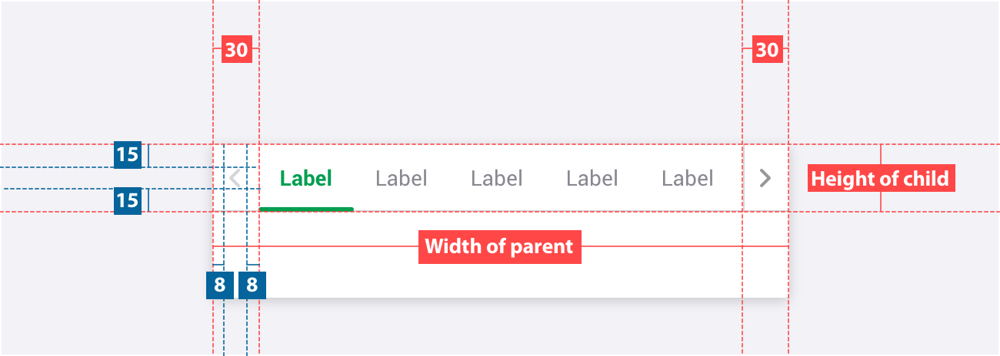
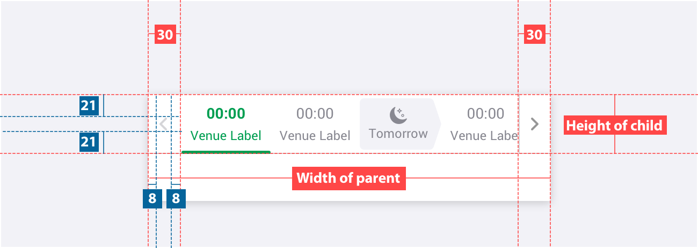
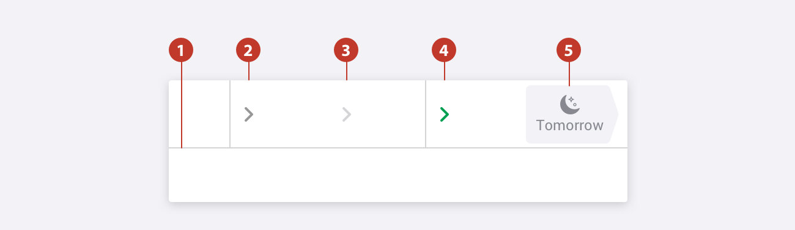
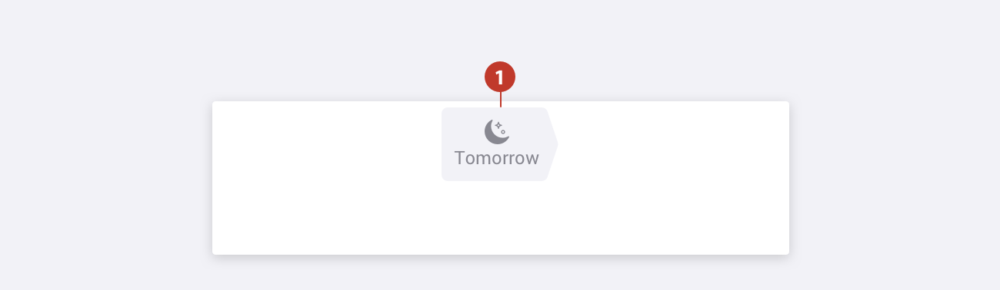

# Tab bar

### About tab bar

Tabs organise web-page content into categories. They allow users to quickly switch between related information without having to refresh the page.

### Usage 

Use tabs for navigating content on a single page and to group content into seperate sections. Tab "buttons" should not be used to perform actions. If you need to provide controls that act on elements in the current view, use a toolbar instead. 

### Structure

1. **Shell** -  Container to group tabs.
2. **Arrows** -  Controls to cycle trough the tab list. Used if there is not enough space for options on tabs for desktop.
3. **Icon** -  Visual element used to signify next or back. 
4. **Badge background** -   A discreet area surrounding the badge.
5. **Badge title** -  The textual label of the badge.

### Types 

1. **Primary** - Should be used as primary local navigation for any destination. 
2. **Secondary** - Should be used for horse racing or greyounds ribbon.
3. **Tertiary** -  Should be used for horse racing or greyounds racecards.

### Specs

##### Primary

##### Secondary

###  

### Colour 

| Element | State          | Category                          | Attribute                                                    |
| ------- | -------------- | --------------------------------- | ------------------------------------------------------------ |
| 1.      | Tab line       | Color Border                 | $color-wood-ash 1px                                     |
| 2.      | Arrow Normal   | Background Icon Divider | $color-white \$color-manatee \$color-wood-ash      |
| 3.      | Arrow disabled | Background Icon              | $color-white \$color-wood-ash                           |
| 4.      | Arrow hover    | Background Icon Divider | $color-white \$color-pigment-green \$color-wood-ash |
| 5.      | Badge          | Background                        | $color-ghost-white                                           |

###  

### Typography

| Element | Category | Attribute                                     | Value                                         |
| ------- | -------- | --------------------------------------------- | --------------------------------------------- |
| 1.      | H200     | Typeface Font Size Line height | Roboto Regular 12px 18px / 1.5 |

### Live Component

In case you want to know more, you can find more information about the tabs on **[storybook](https://abacus.sct.dev.betfair/docs/#/components/tab-bar/)**.