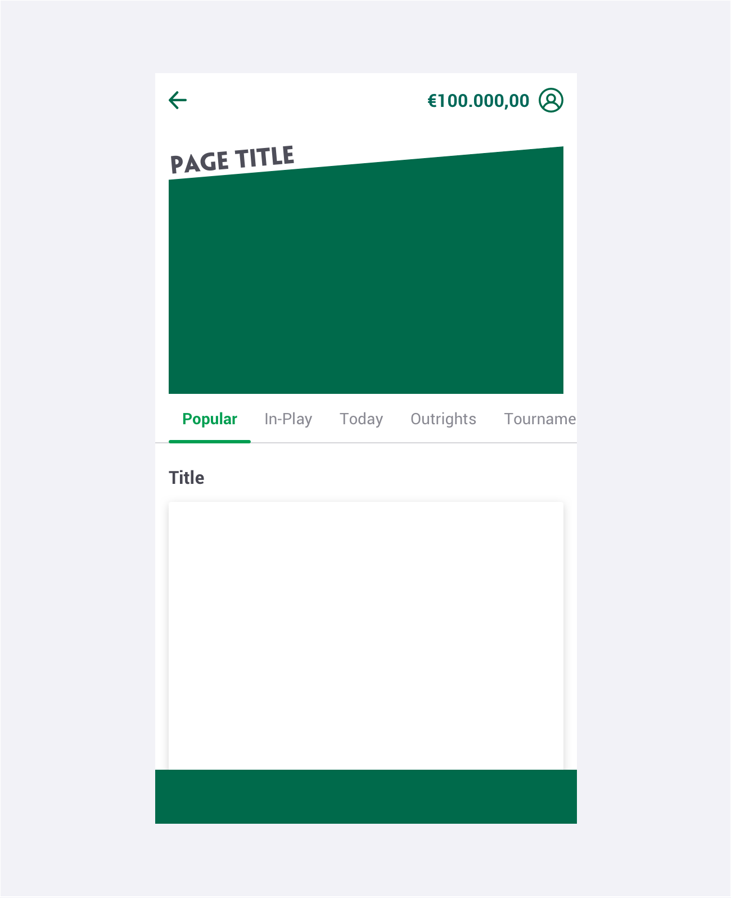
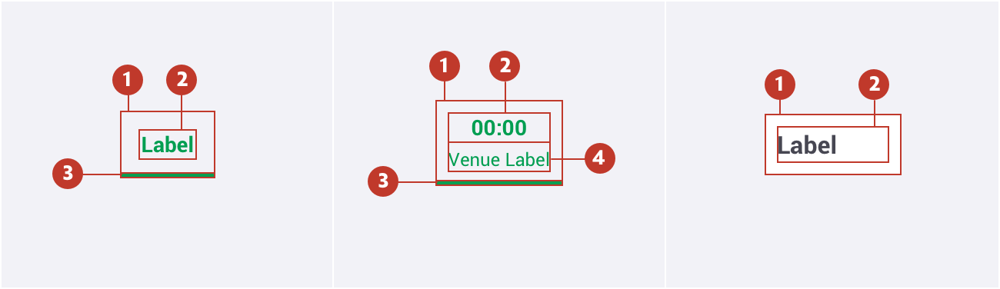
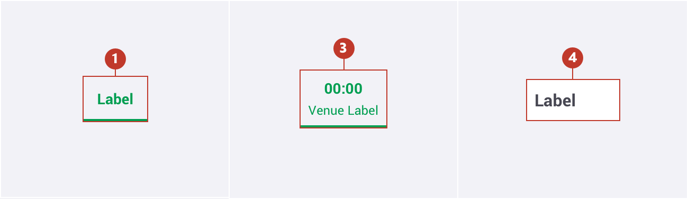
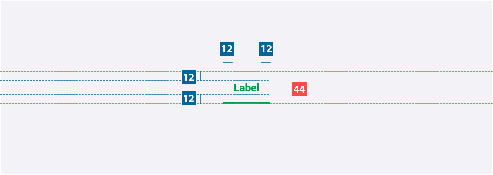
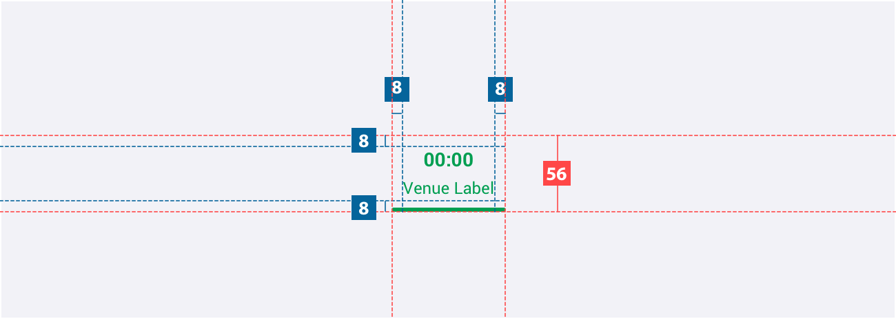
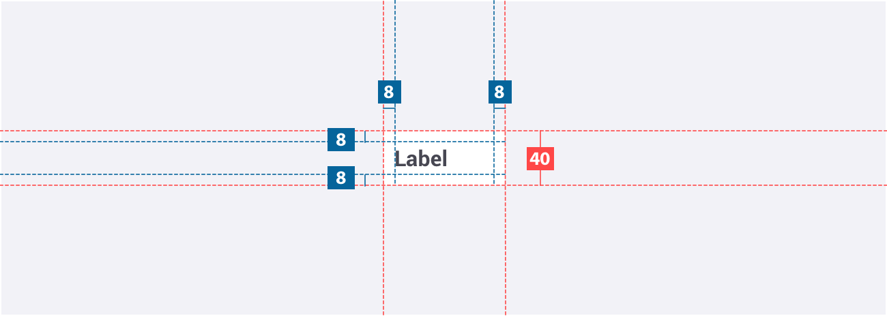
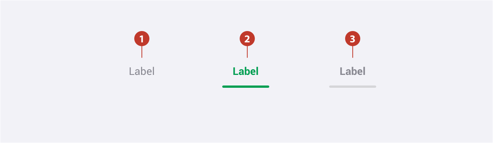
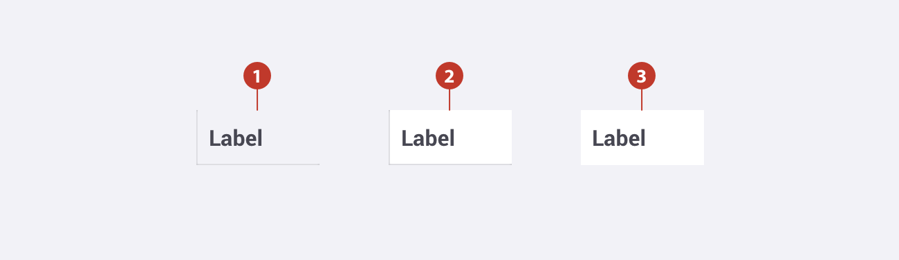
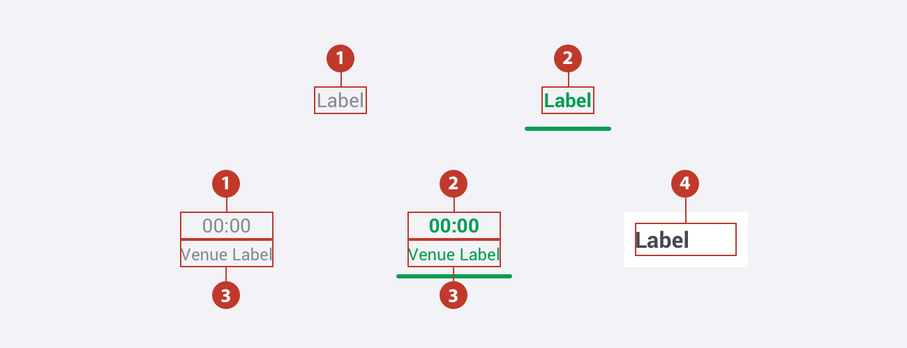

# Tabs

### About tabs

A tab is a single-line array of links formatted as “tabs”.

Tabs are used as the highest level of navigation on a single page to provide access between equivalent types of information that are closely related and mutually exclusive.

### Usage 

When you need to provide access to between 1 and 7 items at the same level in the information hierarchy.

### How to Use

- Use consistent labels to name the tabs.
- The tab menu presents one of the tabs *selected by default*. The selected tab should be the first one in the list, coinciding with the tab the user is more likely to need or access most often.
- Tabs are always left aligned. If all the tabs don't fit in the screen's width, horizontal scroll is activated.
- Tabs do not need to be the same width but the title must be readable.

### How Not to Use

Do not use icons or images alone to form the tab array. Always include a text label at a minimum.

### Structure

1. **Background** -  A discreet area surrounding the expanded tab.
2. **Title** - The textual label of the item. 
3. **Accent line** - Used to show active or focussed tab.
4. **Sub-title** -  Secondary information. May be truncated if bigger than the % of space available.

### Types 

1. **Default** - Should be the most used. 
2. **Secondary** -  Should be used on horse racing or greyounds racecards.
4. **Embedded (*)** - Should be used on lotteries gameplay.

(*) Provisional. Will be changed in future releases to meet the new tabs look and feel.

### Specs

##### Primary

##### Secondary

##### Embedded

This type of tab is always used on top of a card and edge to edge. When using the embedded tabs, a `border-radius:2px` needs to be added to the top corner of the left or right side of the respective outside tabs.

###  

### Colour

##### Primary

| Element | State  | Attribute                                    | Value                                                      |
| ------- | ------ | -------------------------------------------- | ---------------------------------------------------------- |
| 1.      | Normal | Background Text-colour                  | None \$color-manatee                                  |
| 2.      | Active | Background Text-colour Bottom-line | None \$color-pigment-green \$color-pigment-green |
| 3.      | Hover  | Background Text-colour Bottom-line | None \$color-manatee \$color-wood-ash            |

##### 

##### Secondary

| Element | State  | Attribute                                    | Value                                                      |
| ------- | ------ | -------------------------------------------- | ---------------------------------------------------------- |
| 1.      | Normal | Background Text-colour                  | None \$color-manatee                                  |
| 2.      | Active | Background Text-colour Bottom-line | None \$color-pigment-green \$color-pigment-green |
| 3.      | Focus  | Background Text-colour Bottom-line | None \$color-manatee \$color-wood-ash            |
| 4.      | Hover  | Background Text-colour Bottom-line | None \$color-manatee \$color-wood-ash            |

##### 

##### Embedded

| Element | State  | Attribute                                                    | Value                                                        |
| ------- | ------ | ------------------------------------------------------------ | ------------------------------------------------------------ |
| 1.      | Normal | Background Inner-shadow-left Inner-shadow-right * Inner-shadow-bottom Text-colour | \$color-ghost-white ​\$color-ghost-white, X:1, Y:0, Blur:2 $color-ghost-white, X:-1, Y:0, Blur:2 \$color-ghost-white, X:0, Y:-1, Blur:2 \$color-gun-powder |
| 2.      | Hover  | Background Inner-shadow-left Inner-shadow-right * Inner-shadow-bottom Text-colour | \$color-white \$color-ghost-white, X:1, Y:0, Blur:2 $color-ghost-white, X:-1, Y:0, Blur:2 \$color-ghost-white, X:0, Y:-1, Blur:2 \$color-gun-power |
| 3.      | Active | Background Text-colour                                  | \$color-white \$color-gun-power                         |

***Note**: when the tab is placed at the left margin the `inner-shadow-left` is replaced by `inner-shadow-right`. In all other cases, the `inner-shadow-right` is not displayed.

### Typography

| Element | Category  | Attribute                                     | Value                                         |
| ------- | --------- | --------------------------------------------- | --------------------------------------------- |
| 1.      | H300      | Typeface Font Size Line height | Roboto Regular 14px 20px / 1.4 |
| 2.      | H300 Bold | Typeface Font Size Line height | Roboto Bold 14px 20px / 1.4    |
| 3.      | H200      | Typeface Font Size Line height | Roboto Regular 12px 20px / 1.4 |
| 4.      | H400 Bold | Typeface Font Size Line height | Roboto Bold 16px 24px / 1.5    |

### Interaction & transition

### Live Component

In case you want to know more, you can find more information about the tabs on **[storybook](http://abacus.sct.dev.betfair/docs/#/)**.