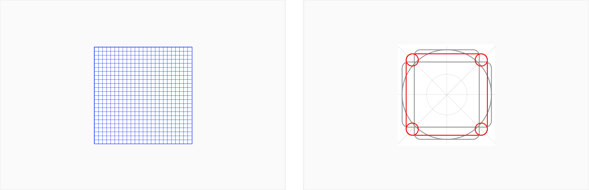

## Iconography

### System icons

System icons communicate a message and should be distinct and informative. They should be simple, yet bold enough to grab attention, and leave a lasting impression.

### Sports icons

### Usage

- Icons should be designed on a 22px grid and exported with padding on a 24px artboard.
- Build from foundational shapes: square, circle, or rectangles (horizontal or vertical).
- When scaling down icons, smaller elements should be solid to help with legibility.

### Icon grid

Regular icons are designed on a 24px grid. Use the grid as your basic guideline to snap the artwork in place. 

### Shapes

Create icons on the grid using basic foundational shapes. These include circle, square and rectangles (horizontal and vertical). 

### Filled vs. outlined

Use both filled and outlined icons depending the required context. 

### Stroke

System icons use a consistent stroke width of 2px, including curves, angles, and both interior and exterior strokes.

Use consistent stroke weights and squared stroke terminals.

### Angles

When creating shapes like arrows or when you need more real estate, use angles that are 45 or 90 degrees. When more subtlety is required, use 30 or 60 degree angles.

### Corner

An icon’s corner radius consists of curved exterior corners.The recommended corner radius is 2px.  

​	