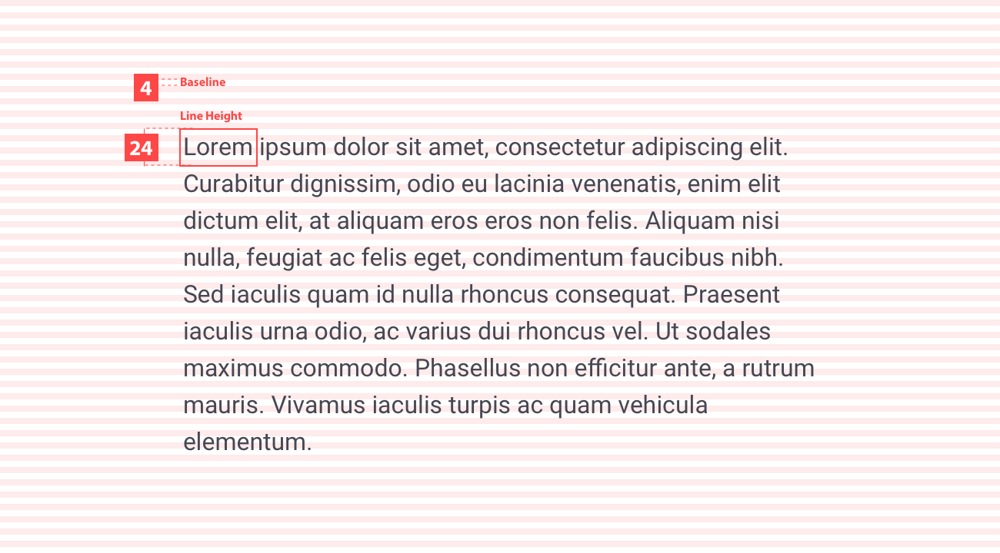

# Spacing

### About spacings

Spacing can be considered a breathing room of element’s boundary. You can add spacing to the top, bottom, left, and right of an element. You can apply the spacing values to one side, two complimentary sides, or to all four sides.  

### Baseline grid

All components align to an 4px square baseline grid for mobile, tablet, and desktop.

> Elements align to a 4px grid. 

### Spacing methods

Use the spacing system when building individual components or general layouts. It includes small increments needed to create appropriate detailed level designs. This scale is applied and used within all components and layouts.

#### Padding

> Padding method

Padding refers to the space between UI elements, can be measured vertically and horizontally. 

> A layout with 12px padding between components.

> Padding be used on components. 

### Vertical rhythm

Paddy Power base font is 16px, which produces a 4px baseline. All text flows vertically along this baseline, creating a similar rhythm across all screens. This rhythm is created by the 24px line height between each line of text and the margin between elements.

### Breakpoint table 

The margin from the content and the margins of the device are different from mobile and desktop:

| Left/Right Margin | Device Size |
| ----------------- | ----------- |
| 12px              | ≤768        |
| 24px              | ≥768        |

