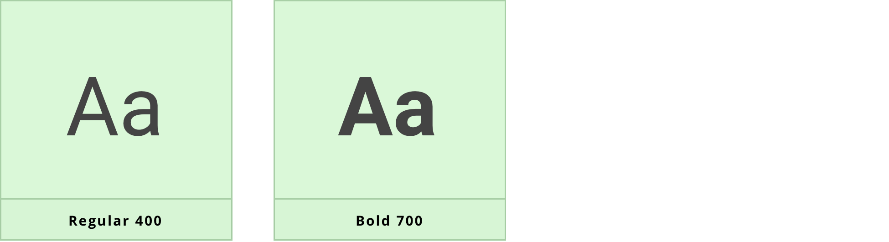
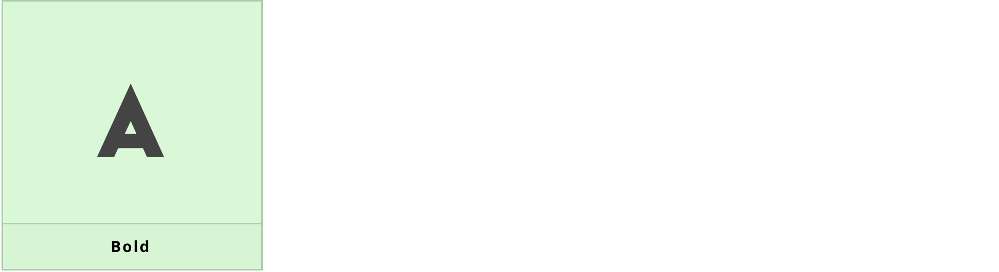
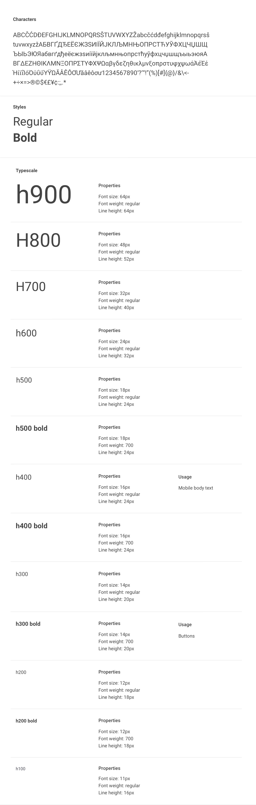
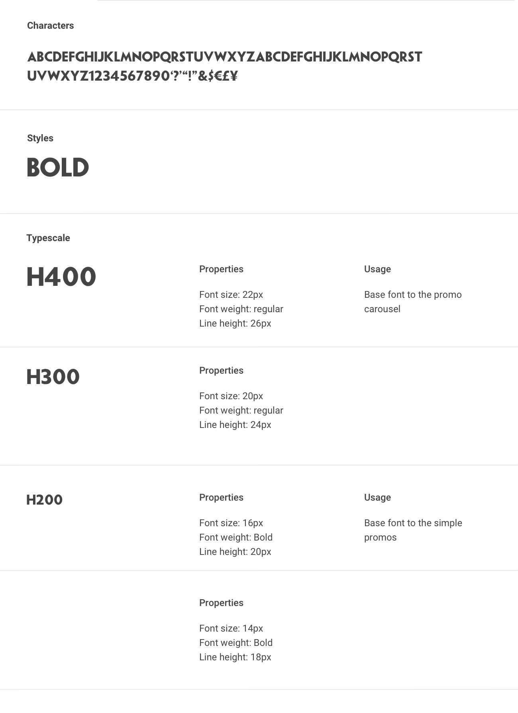
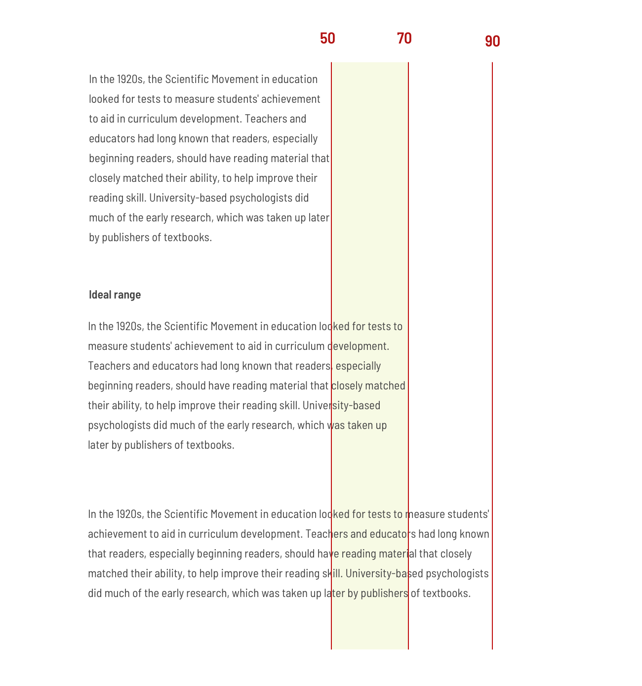

# Typography

## About typography

Keeping consist and sticking to logical hierarchies ensures that elements in the UI are clear and easily recognizable when scanning the page. Text sizes, styles, and layouts were selected to balance content and UI and to foster familiarity.

## Usage

Text is the major channel for users to understand application content and complete their work, and a well designed font system will greatly enhance the user's reading experience and work efficiency.

### Base Font

While defining the font system for a visual system, we propose to start from the following five aspects:

1. Font Family

2. Font Weight

3. Font Scale

4. Line Height

5. Letter Spacing

## Font Family & Weights 

### Roboto

Roboto is the default typeface used for everything in all of the Paddy Power applications and the website.

### Mischief 

Mischief is Paddy Power's primary typeface as it is a clear, distinctive and highly legible sans serif font, with its simple rounded characteristics acting as a strong visual link to the brand mark.

It is used on all applications where possible, for headings, or to give emphasis within text, as it is only available in upper case letters and in one weight:  bold.

## Type Scale

The type scale is a combination of 8 styles that are supported by the type system. It contains reusable categories of text, each with an intended application and meaning.

### Roboto (primary font)

### Mischief  (secondary font)

## Line lenght 

Wide lines of text are difficult to read and make it harder for people to focus. While there is no right way to measure the perfect width for text, a good goal is to aim for between 60 and 100 characters per line including spacing. Setting an optimal line length will break up content into easily digestible information

Readers may also have control over the layout width; meaning that a line length can not always be specified. So it's good practice to design for an ideal line length range under normal circumstances, and use responsive design techniques to anticipate different contexts.

